# Pi-Harness

<p align="center">
  
</p>

<p align="center">
  <strong><a href="https://github.com/badlogic/pi-mono">Pi Coding Agent</a> のオールインワン・デスクトップワークスペース</strong><br />
  Pi を構成 · Agent を実行 · モデル、Skills、パッケージ、プロジェクトを管理
</p>

<p align="center">
  Pi Coding Agent の設定・実行・拡張に必要な機能を、1 つのネイティブデスクトップアプリにまとめます。
</p>

<p align="center">
  <a href="README.md">English</a> ·
  <a href="README.zh-CN.md">简体中文</a> ·
  <a href="README.zh-TW.md">繁體中文</a> ·
  <a href="README.ja-JP.md">日本語</a> ·
  <a href="README.ko-KR.md">한국어</a> ·
  <a href="README.ru-RU.md">Русский</a> ·
  <a href="README.fr-FR.md">Français</a> ·
  <a href="README.de-DE.md">Deutsch</a>
</p>

<p align="center">
  <a href="https://github.com/wangmiaozero/pi-harness/releases/tag/v1.1.2"></a>
  
  <a href="LICENSE"></a>
</p>

<p align="center">
  <a href="docs/workspace.mp4?raw=1"></a><br />
  <a href="docs/workspace.mp4?raw=1">▶ Pi-Harness ワークスペースのデモを見る</a>
</p>

## Why Pi-Harness?

### 単なる Pi チャット UI ではありません

一般的なデスクトップクライアントは、Pi を開いてチャットを始めるためのものです。Pi-Harness は、環境設定、Provider、モデル、Skills、パッケージ、プロジェクト、ファイル、Git を 1 つのデスクトップワークスペースにまとめます。

```text
一般的なデスクトップクライアント        Pi-Harness

Pi → Chat                             Environment
                                      + Providers / Models
                                      + Skills / Packages / MCP adapters
                                      + Workspace / Sessions / Files / Git
                                      ↓
                                      Pi Coding Agent
```

Pi-Harness は Web UI のラッパーではありません。pi-web、Next.js サーバー、iframe を組み込まず、2 つ目の Agent Runtime も実装しません。Pi Coding Agent が唯一の Agent Runtime であり、セッションは ~/.pi/agent/sessions/ にある Pi CLI の JSONL と互換性があります。

**Pi を構成。Pi を実行。Pi を拡張。**

## ダウンロード

[GitHub Releases](https://github.com/wangmiaozero/pi-harness/releases/tag/v1.1.2) から Pi-Harness v1.1.2 をダウンロードしてください。

| プラットフォーム    | インストーラー                                                                                                               |
| ------------------- | ---------------------------------------------------------------------------------------------------------------------------- |
| macOS Apple Silicon | [Pi-Harness-1.1.2-arm64.dmg](https://github.com/wangmiaozero/pi-harness/releases/download/v1.1.2/Pi-Harness-1.1.2-arm64.dmg) |
| macOS Intel         | [Pi-Harness-1.1.2.dmg](https://github.com/wangmiaozero/pi-harness/releases/download/v1.1.2/Pi-Harness-1.1.2.dmg)             |
| Windows x64         | [Pi-Harness.Setup.1.1.2.exe](https://github.com/wangmiaozero/pi-harness/releases/download/v1.1.2/Pi-Harness.Setup.1.1.2.exe) |

> macOS のコミュニティビルドは署名されていない場合があります。初回起動がブロックされた場合は、**システム設定 → プライバシーとセキュリティ → このまま開く**を使用してください。詳細は [v1.1.2 リリースノート](https://github.com/wangmiaozero/pi-harness/releases/tag/v1.1.2)を参照してください。

パッケージ版の利用者は、リポジトリの clone や pnpm のインストールを行う必要はありません。Pi-Harness は、対応環境で Node.js、npm、PATH、Pi Coding Agent を検出し、インストールまたは修復できます。

## できること

- **Workspace:** 実際のプロジェクトで Pi セッションを開始または再開し、ストリーミング応答、Thinking、Tool Call、ファイル、Git を同じ場所で扱えます。
- **Providers & Models:** Pi 互換の Provider とモデルを設定し、接続テストと使用モデルの選択を行えます。
- **Skills, Packages & MCP:** ローカル Skills と Pi パッケージを管理し、対応パッケージ経由で MCP に接続できます。
- **Environment:** Node.js、npm、PATH、Pi を検出し、よくあるインストール問題をデスクトップアプリから解決できます。
- **Files & Git:** ファイルの閲覧とアップロード、競合保護付きの軽量編集、Git Diff、Worktree を利用できます。
- **Diagnostics:** アプリケーションと環境の状態を確認できます。

## 利用の流れ

1. Pi-Harness を起動し、環境の状態を確認します。
2. Provider を設定します。
3. モデルを選択し、接続をテストします。
4. プロジェクトを開きます。
5. Pi セッションを開始または再開します。

```text
インストール → Provider を設定 → モデルを選択 → プロジェクトを開く → Pi を実行
```

## スクリーンショット

### 1. 準備状況を確認

概要画面では、現在のモデル、Pi の実行環境、設定の状態、よく使う操作をまとめて確認できます。

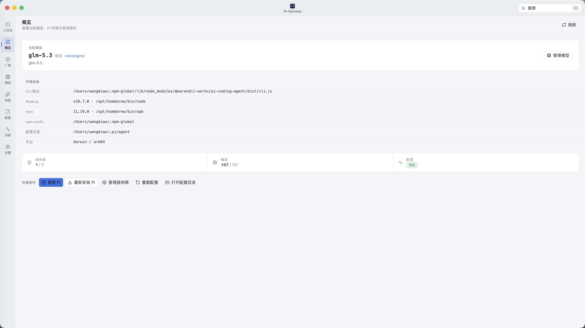

### 2. 実際のプロジェクトで Pi を実行

|             プロジェクトのセッション             |                ファイルと軽量編集                |
| :----------------------------------------------: | :----------------------------------------------: |
| 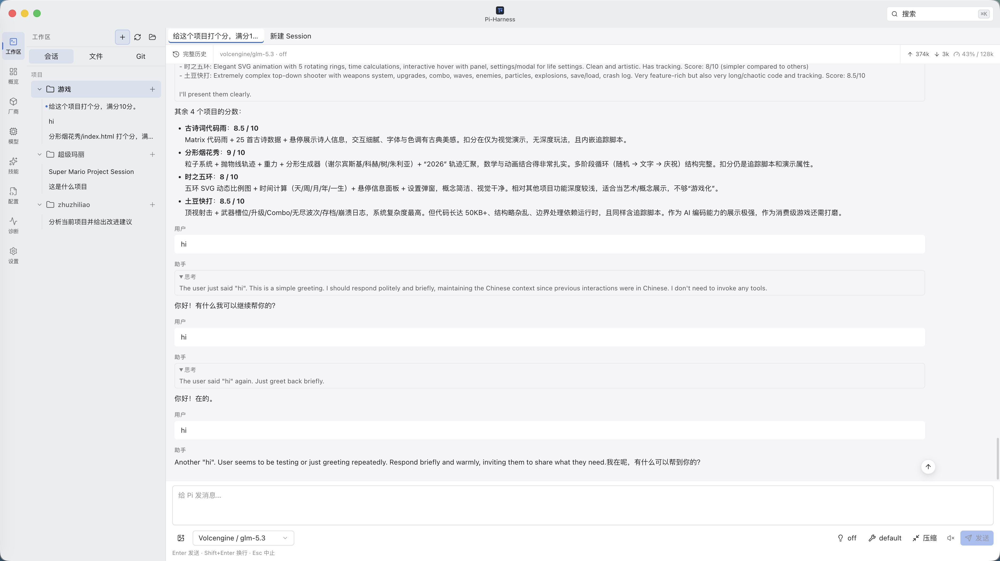 | 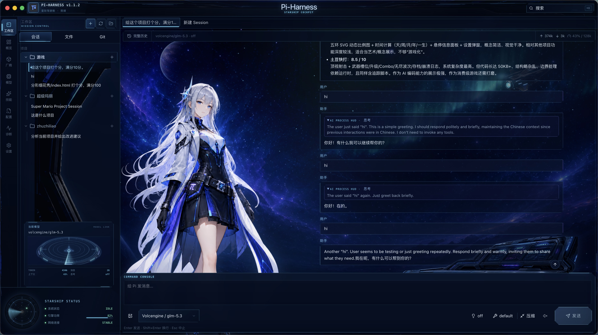 |

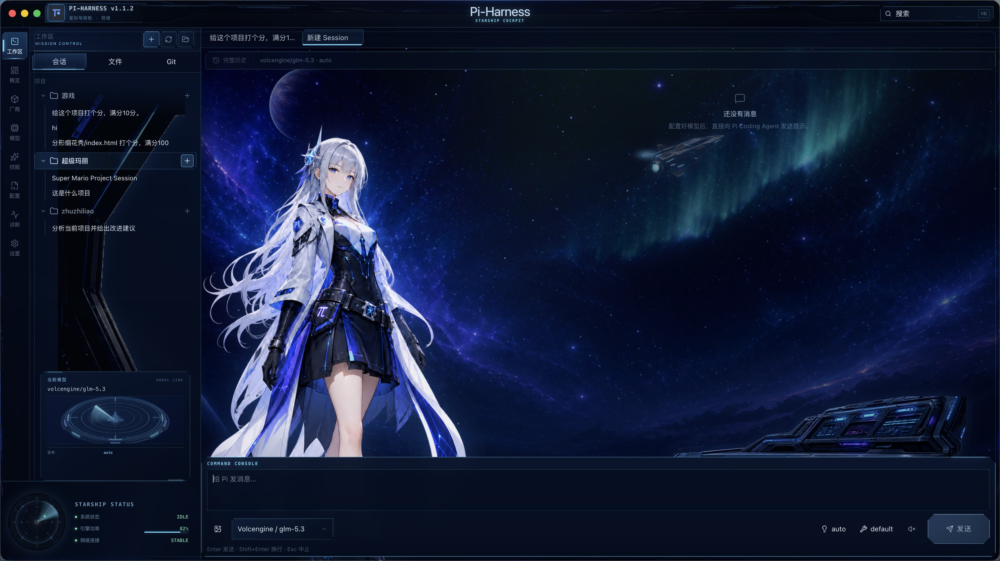

### 3. Provider とモデルを設定

|              Provider               |            Provider の設定            |
| :---------------------------------: | :-----------------------------------: |
| 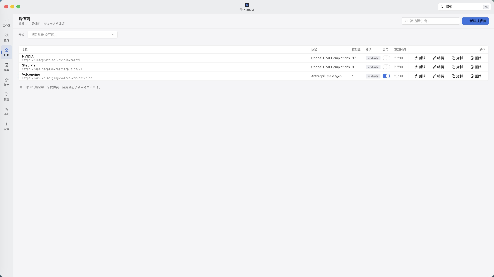 | 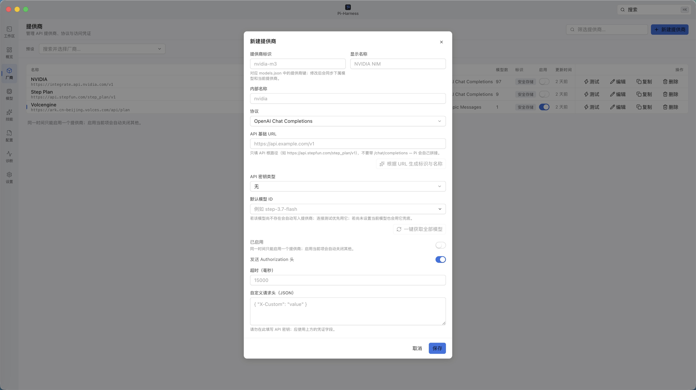 |
|             **モデル**              |            **モデル設定**             |
|   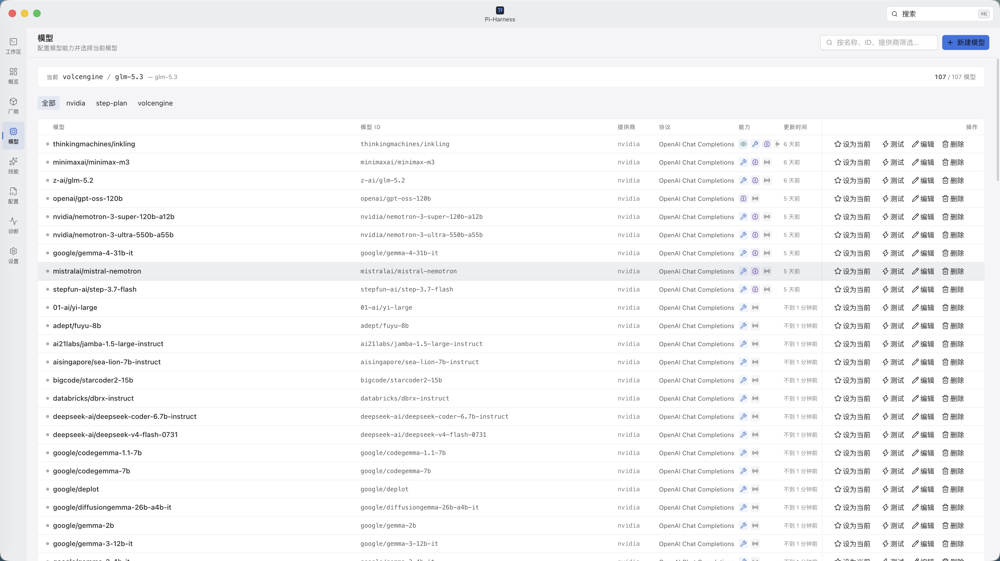    |   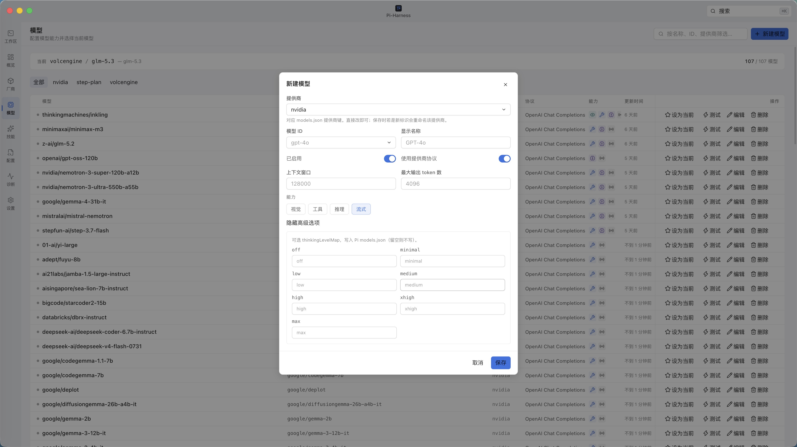    |

### 4. Skills とパッケージで Pi を拡張

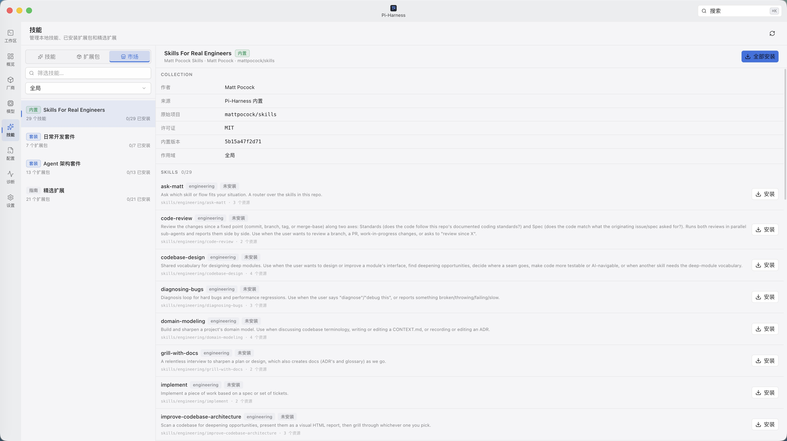

### 5. ワークスペースをカスタマイズ

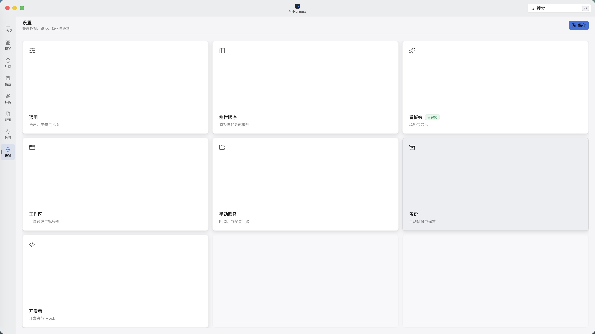

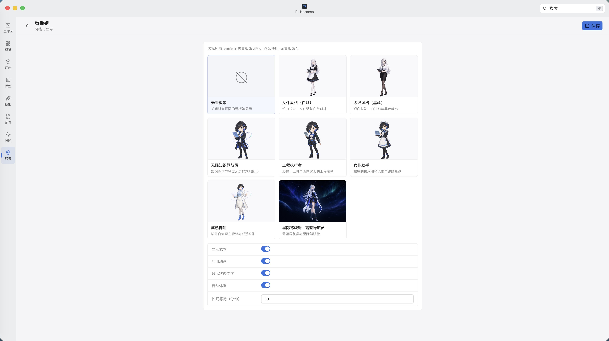

## エディターの範囲

Pi-Harness は、シンタックスハイライト、行番号、元に戻す／やり直し、検索、明示的な保存、未保存状態、外部変更との競合保護を備えた軽量テキストエディターを提供します。大容量ファイル、バイナリ、メディア、ドキュメントは読み取り専用でプレビューします。

Pi-Harness は IDE ではありません。LSP/IntelliSense、セマンティックリファクタリング、デバッガー、タスクランナー、統合ターミナル、IDE 拡張機能との互換性は提供しません。

## アーキテクチャ

```text
                                Pi-Harness

              ┌────────────────────┼────────────────────┐
              ▼                    ▼                    ▼
       Control Plane          Workspace          Capability Layer
       Pi を管理              Pi を利用          Pi を拡張

       Providers              Projects           Skills
       Models                 Sessions           Packages
       Environment            Agent              MCP adapters
       Config / Secrets       Streaming          Presets
       Backup / Diagnostics   Files / Git
       Updates                Worktree
              └────────────────────┼────────────────────┘
                                   ▼
                           Pi Coding Agent
```

Pi Coding Agent が唯一の Agent Runtime です。

## 必要環境

パッケージ版：

- macOS Apple Silicon、macOS Intel、または Windows x64
- Pi-Harness からインストールまたは修復できる Pi Coding Agent

ソースから開発する場合：

- Node.js ≥ 22
- pnpm 9.12.1

## 開発

```bash
pnpm install --frozen-lockfile
pnpm dev
```

主なチェックコマンドは、pnpm typecheck、pnpm lint、pnpm test、pnpm compile、pnpm test:e2e:only です。Renderer バンドルに含まれるため、VITE_* 変数に秘密情報を保存しないでください。

## ドキュメント

- [変更履歴](CHANGELOG.md)

## ライセンス

Pi-Harness は [GNU Affero General Public License v3.0 only](LICENSE)（AGPL-3.0-only）の下で公開されています。

Copyright © 2026 [wangmiao](https://github.com/wangmiaozero).

## 作者

[wangmiao](https://github.com/wangmiaozero) · [tuziling84@gmail.com](mailto:tuziling84@gmail.com) · [github.com/wangmiaozero/pi-harness](https://github.com/wangmiaozero/pi-harness)
