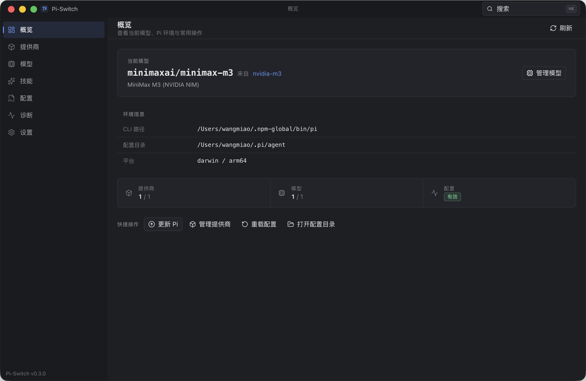
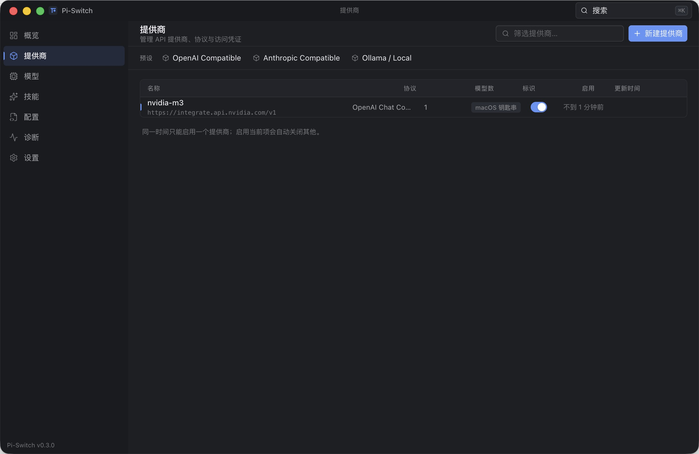
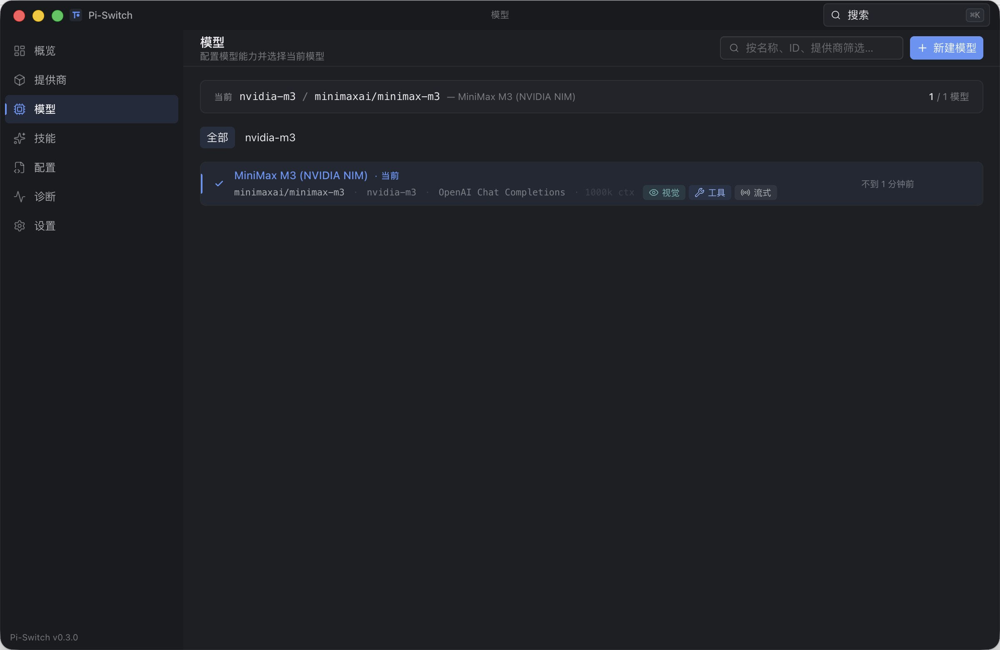
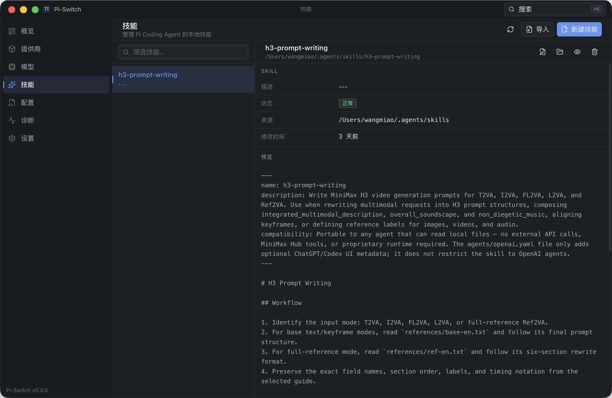

# Pi-Switch

<p align="center">
  
</p>

<p align="center">
  <strong><a href="https://github.com/badlogic/pi-mono">Pi Coding Agent</a>를 위한 올인원 데스크톱 관리자</strong><br />
  로컬 우선 데스크톱 구성 관리자 · Electron · Vue 3 · TypeScript
</p>

<p align="center">
  <a href="README.md">English</a> ·
  <a href="README.zh-CN.md">简体中文</a> ·
  <a href="README.ko-KR.md">한국어</a> ·
  <a href="README.ru-RU.md">Русский</a> ·
  <a href="README.fr-FR.md">Français</a> ·
  <a href="README.de-DE.md">Deutsch</a>
</p>

<p align="center">
  
  
  
  
</p>

데스크톱 UI에서 제공자, 모델, API 키, 스킬, 원본 Pi 구성, 백업, 진단을 관리합니다. `~/.pi/agent/*.json`을 직접 편집할 필요가 없습니다.

비밀 값은 Renderer에 평문으로 노출되지 않습니다. macOS는 시스템 키체인에 저장하고, Windows / Linux는 Electron `safeStorage`를 사용합니다. 알 수 없는 Pi 필드는 그대로 유지됩니다.

## 화면 미리보기

| 개요 | 제공자 |
| :---: | :---: |
|  |  |
| **모델** | **스킬** |
|  |  |

## 기능

| 모듈 | 설명 |
| --- | --- |
| **개요** | 활성 모델, Pi CLI / 구성 디렉터리, 환경 상태, 자주 쓰는 작업 |
| **제공자** | Provider ≠ Protocol ≠ Model; 자격 증명은 Keychain / `safeStorage`에 저장 |
| **모델** | 기능 플래그, 활성 모델, 연결 테스트; 쓰기 후 `settings.json`을 다시 읽어 검증 |
| **스킬** | `SKILL.md` 생성 / 가져오기 / 편집 / 검증; 경로 루트 제약 |
| **구성** | CodeMirror로 `models.json` / `settings.json` 편집; 서식 지정 및 파일 관리자에서 표시 |
| **진단** | 환경 보고서; 복사 시 민감 정보 제거 (`apiKey` / `token` / `secret` 등) |
| **설정** | 简体中文 / English / 한국어 / Русский / Français / Deutsch, 다크 / 라이트, 표준 / 컴팩트 밀도, 백업 |

안정성:

- 쓰기 전 자동 백업; 원자적 쓰기
- 외부 변경 감지(mtime), Reload / Compare / Overwrite
- 패키지 빌드는 `electron-updater` 지원(자동 설치 없음)
- 데스크톱 전용: 외부 브라우저 창과 앱 밖 URL 이동을 차단

## 요구 사항

- Node.js ≥ 22 (의존성 설치 시 강제)
- pnpm `9.12.1` (`packageManager` 필드 참고)
- [Pi Coding Agent](https://github.com/badlogic/pi-mono) 설치, 또는 앱에서 설치 / 업데이트

## 빠른 시작

```bash
pnpm install
pnpm dev
```

로컬 Pi가 없으면 설정에서 구성 디렉터리를 `fixtures/mock-pi/`로 지정하거나:

```bash
cp .env.example .env
# PI_SWITCH_PI_CONFIG_DIR=/absolute/path/to/fixtures/mock-pi
```

비밀 값을 `VITE_*`에 넣지 마세요. Renderer 번들에 포함됩니다.

## 명령

| 명령 | 설명 |
| --- | --- |
| `pnpm typecheck` | Vue / TypeScript 타입 검사 |
| `pnpm lint` | ESLint |
| `pnpm test` | Vitest 단위 테스트 |
| `pnpm test:e2e` | 컴파일 후 Playwright Electron smoke 실행 |
| `pnpm compile` | Vite로 `out/`에 컴파일 (설치 패키지 없음) |
| `pnpm build` | 컴파일 후 macOS / Windows / Linux 패키지 → `release/` |
| `pnpm build:mac` | macOS만 |

## 아키텍처

```
Renderer (Vue 3)  --typed IPC-->  Preload  -->  Main
                                                ├─ PiConfigService   원자적 쓰기 / mtime 충돌
                                                ├─ Provider / Model / Skills / Backup / Diagnostics
                                                └─ SecretStore       Keychain / safeStorage
```

Domain은 Adapter를 통해 Pi 네이티브 JSON과 분리됩니다. 알 수 없는 필드는 그대로 전달되며, 특정 모델 이름에 로직을 고정하지 않습니다.

## 저자

[wangmiao](https://github.com/wangmiaozero) · [tuziling84@gmail.com](mailto:tuziling84@gmail.com) · [github.com/wangmiaozero/pi-switch](https://github.com/wangmiaozero/pi-switch)

## 라이선스

[MIT](./LICENSE) © 2026 wangmiao
