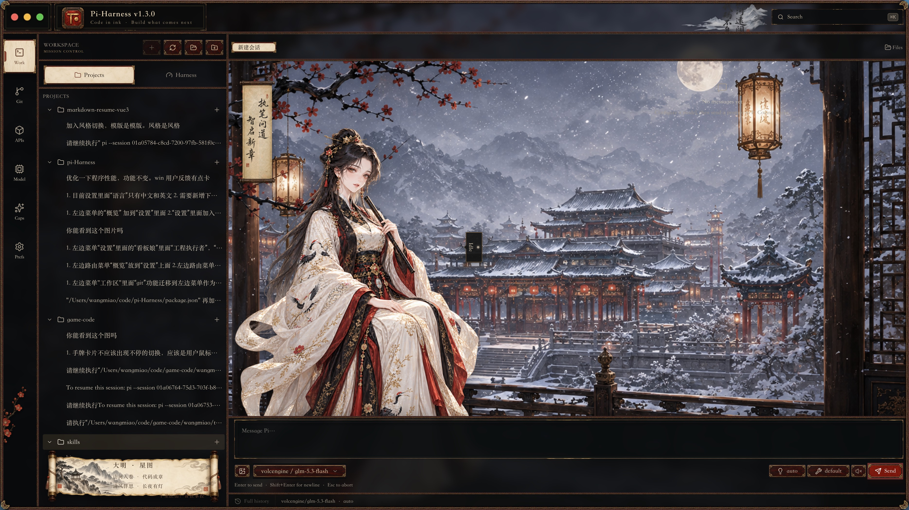

# Pi-Harness

<p align="center">
  <a href="README.md">English</a> ·
  <a href="README.zh-CN.md">简体中文</a> ·
  <a href="README.zh-TW.md">繁體中文</a> ·
  <a href="README.ja-JP.md">日本語</a> ·
  <a href="README.ko-KR.md">한국어</a> ·
  <a href="README.ru-RU.md">Русский</a> ·
  <a href="README.fr-FR.md">Français</a> ·
  <a href="README.de-DE.md">Deutsch</a>
</p>

<p align="center">
  
</p>

<h3 align="center">Desktop Harness &amp; Control Center for Pi Coding Agent</h3>

<p align="center">
  <strong>Bring Pi Agent Harness into a visual desktop workspace.</strong>
</p>

<p align="center">Everything around Pi, in one place.</p>

<p align="center">
  Manage models · Run agents · Inspect Harness state · Use Skills · Browse files · Control Git
</p>

<p align="center">
  <a href="#download"><strong>Download Pi-Harness</strong></a> ·
  <a href="https://github.com/earendil-works/pi">Pi Agent Harness</a> ·
  <a href="#current-screenshots">Screenshots</a>
</p>

<p align="center">
  <a href="https://github.com/wangmiaozero/pi-harness/releases/tag/v1.3.0"></a>
  
  <a href="LICENSE"></a>
  <a href="https://github.com/wangmiaozero/pi-harness/stargazers"></a>
</p>

<p align="center">
  ⭐ <a href="https://github.com/wangmiaozero/pi-harness/stargazers">Star Pi-Harness</a> to follow the next Harness Console updates.
</p>

## Why Pi-Harness?

Pi-Harness is a visual Harness Console for Pi Coding Agent. Use Native Pi as-is, or discover and manage optional development methodologies, Skills, extensions, packages, and MCP tools.

[Pi Coding Agent](https://github.com/earendil-works/pi) already has a powerful Agent Harness. Much of its runtime state—context, tools, compaction, queues, and sessions—is naturally exposed through CLI and SDK behavior.

Pi-Harness makes those capabilities visible and manageable in a native desktop workspace, alongside the configuration and project tools needed to use Pi every day.

> **Pi runs the agent. Pi-Harness lets you see and control how it runs.**

Pi-Harness is not a wrapped web UI. It embeds no pi-web, Next.js server, or iframe, and it does not add a second Agent Runtime.

## Powered by Pi Agent Harness

[Pi](https://github.com/earendil-works/pi) already provides the Agent Harness that powers Pi Coding Agent.

Pi-Harness does not replace or reimplement that runtime. Pi Coding Agent and its Agent Harness remain responsible for the Agent Loop, tools, context, compaction, and session execution.

Pi-Harness provides the desktop control plane, visualization, configuration, and workspace around it:

- inspect runtime and context state
- start, resume, fork, and navigate sessions
- select models, Thinking levels, and tools
- control compaction, Steering, and Follow-up messages
- observe streaming output, Thinking, Tool Calls, and agent events
- work with files and Git beside the agent

**Powered by Pi Agent Harness.**

## What Pi-Harness already does

These are current capabilities, not roadmap claims: Pi-Harness can start and resume Pi-compatible sessions; stream responses, Thinking, and Tool Calls; show context usage and session statistics; switch models, Thinking levels, and tool presets; control compaction; send Steering and Follow-up messages; and Fork or navigate session history.

The surrounding desktop capabilities are summarized below.

## Core features

| Area               | What Pi-Harness does                                                  |
| ------------------ | --------------------------------------------------------------------- |
| Overview           | Shows environment, configuration, and current model status            |
| Workspace          | Runs Pi sessions beside project files, Git, and worktrees             |
| Pi Runtime         | Surfaces streaming, Thinking, Tool Calls, context, queues, and stats  |
| Providers & Models | Manages Pi-compatible providers and models                            |
| Skills & Packages  | Manages supported Skills, Pi packages, and MCP-capable extensions     |
| Files              | Provides lightweight editing with explicit save and conflict handling |
| Diagnostics        | Reports application, environment, storage, and workspace health       |
| Updates            | Installs compatible application updates                               |
| Appearance         | Offers appearance, density, cockpit mode, and optional themes         |

### Optional methodologies and add-ons

Native Pi remains the built-in default runtime and workflow. Pi-Harness does not replace it and does not silently install or enable third-party methodologies.

- [Superpowers](https://github.com/obra/superpowers) is the recommended optional add-on: a complete software development methodology for coding agents covering brainstorming, planning, TDD, systematic debugging, Git worktrees, subagent and parallel-agent workflows, code review, and verification. Install it explicitly from Capabilities with `pi install git:github.com/obra/superpowers`.
- [Odai](https://github.com/orziz/odai) remains an optional governance and adaptive-execution methodology for goal alignment, authorization boundaries, risk awareness, capability routing, evidence, and verification.

Both add-ons use the existing trusted capability/package management flows and can be updated or removed independently.

### Lightweight editor, not an IDE

Pi-Harness edits readable text with lazy syntax highlighting, line numbers, undo/redo, find, explicit save, unsaved-state indicators, and external-change conflict protection. Oversized, binary, media, and document files use read-only previews.

It deliberately does not include LSP/IntelliSense, semantic refactoring, a debugger, task runner, integrated terminal, or IDE extension compatibility.

## Architecture

Pi-Harness separates the desktop control plane from the growing visual Harness Console while keeping Pi Coding Agent as the only Agent Runtime.

```text
                         Pi-Harness

             ┌──────────────┴──────────────┐
             │                             │
       Control Plane                 Harness Console
             │                             │
        Providers                      Runtime
        Models                         Context
        Skills                         Tools
        Packages                       Thinking
        Environment                    Compaction
        Config                         Sessions
        Updates                        Timeline
             │                             │
             └──────────────┬──────────────┘
                            ▼
                    Pi Agent Harness
                            │
                            ▼
                    Pi Coding Agent
                            │
                            ▼
                         Models
```

The Control Plane manages everything around Pi. The Harness Console direction makes Pi Agent Harness state visible. Roadmap-only UI is explicitly marked below.

Pi-Harness connects to Pi through its runtime interfaces. Sessions remain compatible with Pi CLI JSONL under <code>~/.pi/agent/sessions/</code>.

## Current screenshots

The same six product surfaces are shown in both the default and Classical Chinese themes.

### Default theme

|                          Workspace                           |                             Git                              |
| :----------------------------------------------------------: | :----------------------------------------------------------: |
|     |            |
|                        **Providers**                         |                          **Models**                          |
|     |       |
|                       **Capabilities**                       |                       **Preferences**                        |
|  |  |

### Classical Chinese theme

|                             Workspace                              |                                Git                                 |
| :----------------------------------------------------------------: | :----------------------------------------------------------------: |
|     |            |
|                           **Providers**                            |                             **Models**                             |
|     |       |
|                          **Capabilities**                          |                          **Preferences**                           |
|  |  |

## Coming Next

Pi-Harness is evolving from a desktop control center into a complete visual console for Pi Agent Harness.

The next phase focuses on making runtime state easier to inspect without replacing the runtime that Pi already provides.

### Harness Console — planned UI / roadmap preview

```text
┌──────────────────────────────────────────────┐
│ HARNESS                                      │
│                                              │
│ ● Running                                    │
│                                              │
│ Runtime                                      │
│ ───────────────────────────────────────────  │
│ Model              claude-sonnet             │
│ Thinking           High                      │
│ Status             Running                   │
│                                              │
│ Context                                      │
│ ───────────────────────────────────────────  │
│ 74,120 / 128,000                             │
│ █████████████░░░░░░ 58%                      │
│                                              │
│ Compaction                                   │
│ Auto               ON                        │
│ Running            NO                        │
│                                              │
│ Tools                                        │
│ ✓ read   ✓ grep   ✓ edit   ✓ write   ✓ bash │
│                                              │
│ Queue                                        │
│ Steering           0                         │
│ Follow-up          1                         │
└──────────────────────────────────────────────┘
```

### Harness Timeline — planned UI / roadmap preview

```text
12:40:03  Session started
12:40:05  Agent running
12:40:07  Tool · read · src/auth.ts
12:40:10  Tool · grep · refreshToken
12:40:13  Tool · edit · src/auth.ts
12:40:23  Compaction started
12:40:25  Compaction completed
12:40:31  Agent completed
```

These previews communicate product direction. They are not screenshots and do not claim that the complete visual inspectors have shipped.

## Roadmap

### Current

- Released desktop capabilities listed above
- Pi Agent Runtime integration and session controls
- Native project workspace and control plane

### Next

- Complete Harness Console
- Runtime and Context Inspectors
- Tools Inspector and Compaction Control
- Steering and Follow-up Inspector
- Session Tree visualization
- Harness Timeline and Stats

### Later

- Tool Policy and Approval Policy
- Workspace Permissions
- Verification and quality-check integration
- Harness Profiles

## Pi-Harness compared

“Typical desktop client” describes common lightweight chat clients; individual products vary.

| Capability             | Pi CLI            | Typical desktop client | Pi-Harness                        |
| ---------------------- | ----------------- | ---------------------- | --------------------------------- |
| Chat and sessions      | Yes               | Usually                | Yes                               |
| Project workspace      | Terminal          | Basic                  | Native workspace                  |
| Provider management    | Config            | Limited                | Yes                               |
| Skills management      | CLI / files       | Limited                | Yes                               |
| Environment management | Manual            | Rare                   | Yes                               |
| Harness state          | CLI / SDK         | Limited                | Available and growing             |
| Context inspection     | CLI / SDK         | Limited                | Basic now; full inspector planned |
| Tool inspection        | CLI / SDK         | Limited                | Selection now; inspector planned  |
| Compaction control     | CLI / SDK         | Limited                | Yes                               |
| Harness Timeline       | No visual console | Rare                   | Roadmap                           |
| Files and Git          | Terminal          | Varies                 | Yes                               |

## Download

Download Pi-Harness v1.3.0 from [GitHub Releases](https://github.com/wangmiaozero/pi-harness/releases/tag/v1.3.0).

| Platform            | Installer                                                                                                                      |
| ------------------- | ------------------------------------------------------------------------------------------------------------------------------ |
| macOS Apple Silicon | [`Pi-Harness-1.3.0-arm64.dmg`](https://github.com/wangmiaozero/pi-harness/releases/download/v1.3.0/Pi-Harness-1.3.0-arm64.dmg) |
| macOS Intel         | [`Pi-Harness-1.3.0.dmg`](https://github.com/wangmiaozero/pi-harness/releases/download/v1.3.0/Pi-Harness-1.3.0.dmg)             |
| Windows x64         | [`Pi-Harness-Setup-1.3.0.exe`](https://github.com/wangmiaozero/pi-harness/releases/download/v1.3.0/Pi-Harness-Setup-1.3.0.exe) |
| Linux x64           | [`Pi-Harness-1.3.0.AppImage`](https://github.com/wangmiaozero/pi-harness/releases/download/v1.3.0/Pi-Harness-1.3.0.AppImage)   |

> macOS community builds may be unsigned. If macOS blocks the first launch, use **System Settings → Privacy & Security → Open Anyway**. See the [v1.3.0 installation notes](https://github.com/wangmiaozero/pi-harness/releases/tag/v1.3.0).

Packaged users do not need to clone the repository or install pnpm. Pi-Harness can detect, install, and repair Node.js, npm, PATH, and Pi Coding Agent where supported.

## How it works

1. Launch Pi-Harness and let Overview check Node.js, npm, PATH, and Pi.
2. Configure a Pi-compatible provider and choose a model.
3. Open a project in the native Workspace.
4. Start or resume a Pi session.
5. Work with streaming output, Tool Calls, files, and Git in one place.

```text
Install → Configure provider → Select model → Open project → Run Pi
```

## Requirements

For the packaged app:

- macOS Apple Silicon, macOS Intel, Windows x64, or Linux x64
- Pi Coding Agent, which Pi-Harness can install or repair from the app

For development from source:

- Node.js ≥ 22
- pnpm 9.12.1

## Development

```bash
pnpm install --frozen-lockfile
pnpm dev
```

Without a local Pi installation, point **Settings → Config directory** at <code>fixtures/mock-pi/</code>, or copy <code>.env.example</code> to <code>.env</code> and set <code>PI_HARNESS_PI_CONFIG_DIR</code> to that fixture. Never store secrets in <code>VITE_*</code> variables; they are bundled into the renderer.

Common checks:

```bash
pnpm typecheck
pnpm lint
pnpm test
pnpm compile
pnpm test:e2e:only
```

## Follow the project

The next major step is the visual Harness Console shown above. Runtime and Context Inspectors, Tool inspection, Compaction controls, Session Tree visualization, and the Harness Timeline will continue to evolve.

If you want to follow that work, consider giving [Pi-Harness a ⭐](https://github.com/wangmiaozero/pi-harness/stargazers). It helps you find the project again and helps more Pi users discover it.

## Credits

Pi-Harness is a desktop project around the official [Pi Coding Agent and Pi Agent Harness](https://github.com/earendil-works/pi).

Created and maintained by [wangmiao](https://github.com/wangmiaozero) · [tuziling84@gmail.com](mailto:tuziling84@gmail.com).

See the [changelog](CHANGELOG.md) for released changes.

## License

Pi-Harness is free software licensed under the [GNU Affero General Public License v3.0 only](LICENSE) (<code>AGPL-3.0-only</code>). You may use, modify, and redistribute it under the license terms. Modified versions made available over a network must offer their corresponding source to users as required by AGPL v3.

Copyright © 2026 [wangmiao](https://github.com/wangmiaozero).
