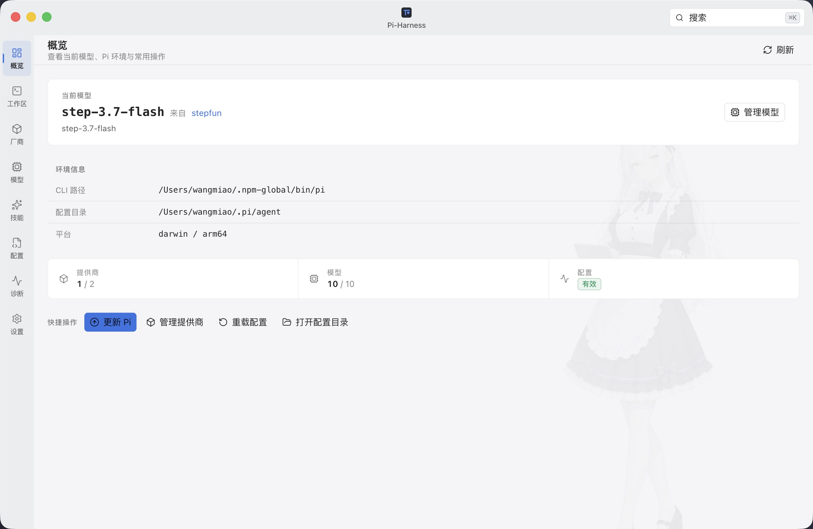
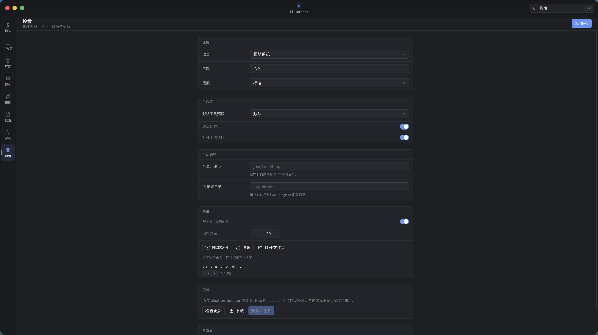
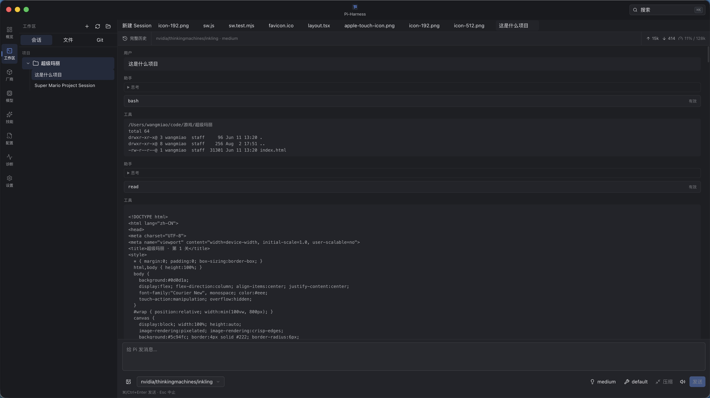
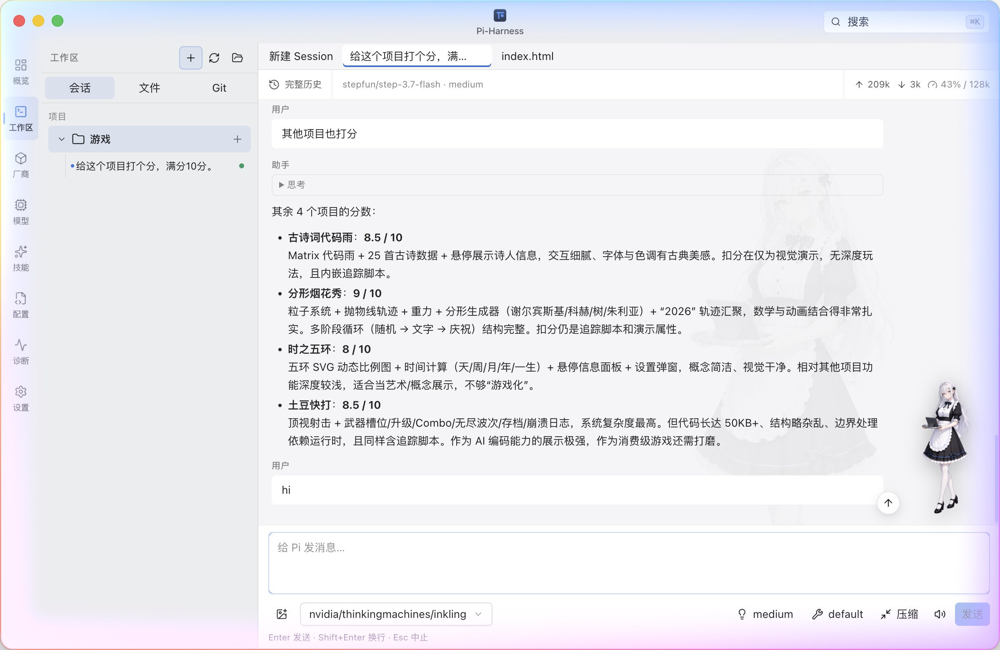
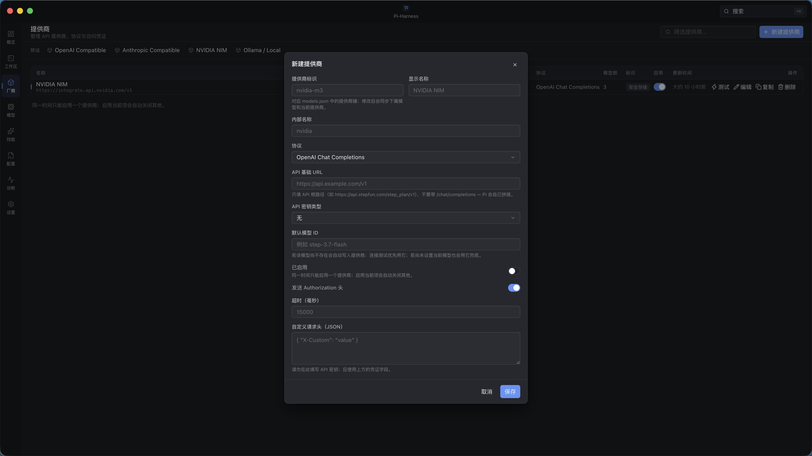
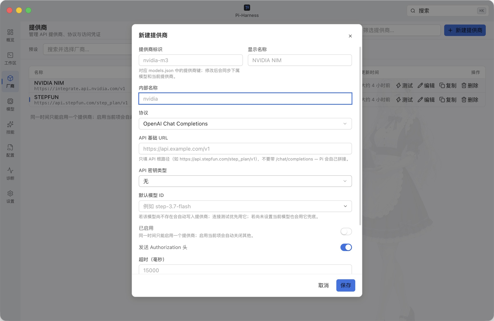
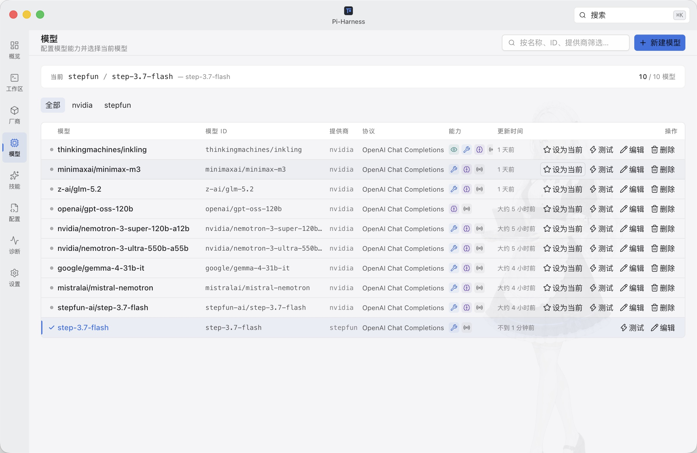
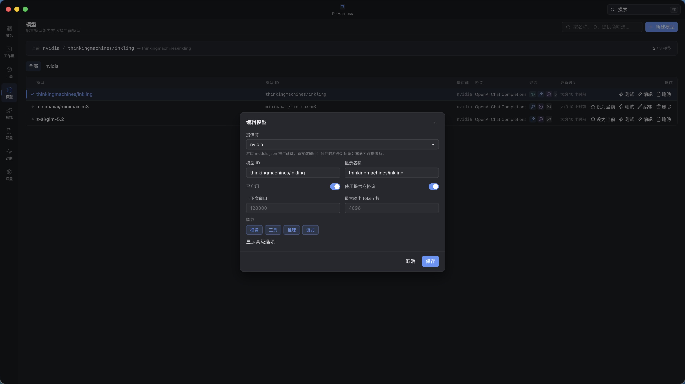
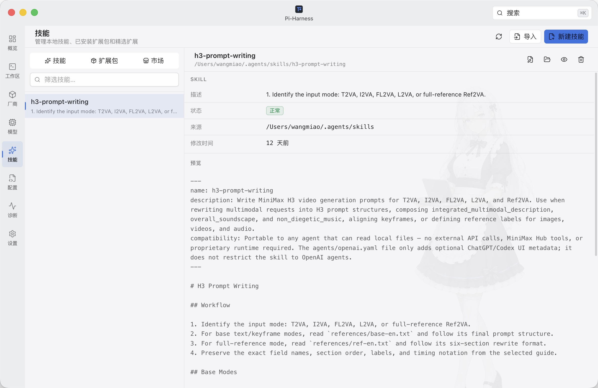
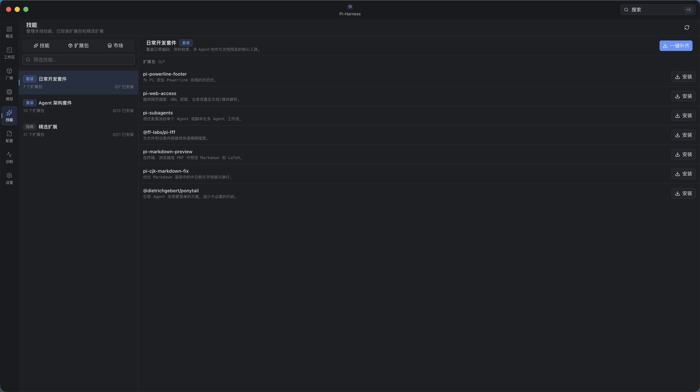

# Pi-Harness

<p align="center">
  
</p>

<p align="center">
  <strong>Полноценный настольный Harness для <a href="https://github.com/badlogic/pi-mono">Pi Coding Agent</a></strong><br />
  Локальный настольный Harness · Electron · Vue 3 · TypeScript
</p>

<p align="center">
  <a href="README.md">English</a> ·
  <a href="README.zh-CN.md">简体中文</a> ·
  <a href="README.ko-KR.md">한국어</a> ·
  <a href="README.ru-RU.md">Русский</a> ·
  <a href="README.fr-FR.md">Français</a> ·
  <a href="README.de-DE.md">Deutsch</a>
</p>

<p align="center">
  
  
  
  
</p>

Управляйте провайдерами, моделями, API-ключами, навыками, конфигурацией Pi, резервными копиями и диагностикой, а затем работайте с Pi Coding Agent над реальным проектом прямо в рабочей области приложения.

Секреты никогда не попадают в Renderer в открытом виде. macOS хранит их в системной связке ключей; Windows и Linux используют Electron `safeStorage`. Неизвестные поля Pi сохраняются.

## Скриншоты

| Обзор | Настройки |
| :---: | :---: |
|  |  |
| **Рабочая область — Сессии** | **Рабочая область — Редактор** |
|  |  |
| **Провайдеры — Список** | **Провайдеры — Детали** |
|  |  |
| **Модели — Список** | **Модели — Детали** |
|  |  |
| **Навыки — Установленные** | **Навыки — Маркет** |
|  |  |

## Возможности

| Модуль | Описание |
| --- | --- |
| **Обзор** | Активная модель, Pi CLI / каталог конфигурации, состояние среды и частые действия |
| **Рабочая область** | Проекты, сессии, потоковый чат, Thinking, Tool Call, лёгкое редактирование кода, Git Diff и Worktree |
| **Провайдеры** | Provider ≠ Protocol ≠ Model; учётные данные в Keychain / `safeStorage` |
| **Модели** | Флаги возможностей, активная модель, проверка соединения; после записи повторно читается `settings.json` |
| **Навыки** | Создание / импорт / правка / проверка `SKILL.md`; ограничение корневыми путями |
| **Конфигурация** | Редактор CodeMirror для `models.json` / `settings.json`; форматирование и показ в файловом менеджере |
| **Диагностика** | Отчёт о среде; при копировании данные очищаются (`apiKey` / `token` / `secret` и т. д.) |
| **Настройки** | 简体中文 / English / 한국어 / Русский / Français / Deutsch, тёмная / светлая тема, стандартная / компактная плотность, резервные копии |

Надёжность:

- Автобэкап перед записью; атомарная запись
- Обнаружение внешних изменений (mtime): Reload / Compare / Overwrite
- Сборки с установщиком поддерживают `electron-updater` (без тихой автоустановки)
- Только десктоп: внешние окна браузера и переход по URL вне приложения блокируются

## Требования

- Node.js ≥ 22 (проверяется при установке зависимостей)
- pnpm `9.12.1` (см. поле `packageManager`)
- Установленный [Pi Coding Agent](https://github.com/badlogic/pi-mono) либо установка / обновление из приложения

## Быстрый старт

```bash
pnpm install
pnpm dev
```

Без локального Pi укажите в настройках каталог `fixtures/mock-pi/` или:

```bash
cp .env.example .env
# PI_HARNESS_PI_CONFIG_DIR=/absolute/path/to/fixtures/mock-pi
```

Не храните секреты в переменных `VITE_*` — они попадают в бандл Renderer.

## Команды

| Команда | Назначение |
| --- | --- |
| `pnpm typecheck` | Проверка типов Vue / TypeScript |
| `pnpm lint` | ESLint |
| `pnpm test` | Модульные тесты Vitest |
| `pnpm test:e2e` | Сборка, затем Playwright Electron smoke |
| `pnpm compile` | Сборка Vite в `out/` (без установщика) |
| `pnpm build` | Сборка и пакеты macOS / Windows / Linux → `release/` |
| `pnpm build:mac` | Только macOS |

## Архитектура

```
Renderer (Vue 3)  --typed IPC-->  Preload  -->  Main
                                                ├─ AgentSession      проекты / сессии / потоковое выполнение
                                                ├─ Workspace         файлы / лёгкий редактор / Git
                                                ├─ PiConfigService   атомарная запись / конфликт mtime
                                                ├─ Provider / Model / Skills / Backup / Diagnostics
                                                └─ SecretStore       Keychain / safeStorage
```

Домен отделён от нативного JSON Pi через Adapter. Неизвестные поля проходят насквозь. Логика не привязана к конкретному имени модели.

## Автор

[wangmiao](https://github.com/wangmiaozero) · [tuziling84@gmail.com](mailto:tuziling84@gmail.com) · [github.com/wangmiaozero/pi-harness](https://github.com/wangmiaozero/pi-harness)

## Лицензия

Pi-Harness — свободное программное обеспечение под лицензией [GNU Affero General Public License v3.0 only](./LICENSE) (`AGPL-3.0-only`). Использование, изменение и распространение разрешены на условиях лицензии. При предоставлении изменённой версии по сети пользователям необходимо предложить соответствующий исходный код согласно AGPL v3.

Copyright © 2026 [wangmiao](https://github.com/wangmiaozero).
