# Pi-Harness

<p align="center">
  <a href="README.md">English</a> ·
  <a href="README.zh-CN.md">简体中文</a> ·
  <a href="README.zh-TW.md">繁體中文</a> ·
  <a href="README.ja-JP.md">日本語</a> ·
  <a href="README.ko-KR.md">한국어</a> ·
  <a href="README.ru-RU.md">Русский</a> ·
  <a href="README.fr-FR.md">Français</a> ·
  <a href="README.de-DE.md">Deutsch</a>
</p>

<p align="center">
  
</p>

<h3 align="center">The Operational Superset of Pi Coding Agent</h3>

<p align="center">
  <strong>Все возможности Native Pi плюс наблюдаемость, управление, восстановление, оценка и Multi-Agent-оркестрация.</strong>
</p>

<p align="center">Native Pi с расширенными возможностями.</p>

<p align="center"><code>Pi Coding Agent ⊂ Pi-Harness</code></p>

<p align="center">
  <a href="https://github.com/wangmiaozero/pi-harness-skin-starter"><strong>Создать свою тему</strong></a>
</p>

<p align="center">
  <a href="https://github.com/wangmiaozero/pi-harness/releases/tag/v1.8.1"></a>
  
  <a href="LICENSE"></a>
</p>

## Зачем нужен Pi-Harness?

Pi-Harness — Operational Superset для Pi Coding Agent. Native Pi остаётся единственным Agent Runtime; совместимые Sessions, Tools, Models, Skills, Extensions, Context и Compaction дополняются наблюдаемостью, управлением, восстановлением, оценкой и Multi-Agent-оркестрацией.

> **Pi запускает Agent, а Pi-Harness превращает его в наблюдаемую, управляемую, восстанавливаемую и оркестрируемую инженерную систему.**

Pi-Harness не заменяет и не переопределяет Agent Runtime Pi.

## Что означает «Superset»

Native Pi всегда остаётся внутри реального пути выполнения; Pi-Harness добавляет вокруг него Harness Control Plane и Visual Engineering Workspace.

## Матрица возможностей Pi и Pi-Harness

| Возможность                          | Native Pi | Pi-Harness                 |
| ------------------------------------ | --------- | -------------------------- |
| Agent Runtime / Loop                 | Да        | Native Pi                  |
| Sessions / Context / Compaction      | Да        | Да + визуальное управление |
| Steering / Follow-up / Thinking      | Да        | Да + визуальное управление |
| Models / Tools / Skills / Extensions | Да        | Да + Manager / Policy      |
| Runs / Trace / Replay / Compare      | —         | Да                         |
| Policy / Budget / Evaluation         | —         | Да                         |
| Checkpoint / Recovery / Diagnostics  | —         | Да                         |
| Regression / Artifacts               | —         | Да                         |
| Multi-Agent / Task DAG / Handoff     | —         | Да                         |
| Review Gates / Worktree isolation    | —         | Да                         |

## Скачать

Скачайте Pi-Harness v1.8.1 из [GitHub Releases](https://github.com/wangmiaozero/pi-harness/releases/tag/v1.8.1).

| Платформа           | Установщик                                                                                                                   |
| ------------------- | ---------------------------------------------------------------------------------------------------------------------------- |
| macOS Apple Silicon | [Pi-Harness-1.8.1-arm64.dmg](https://github.com/wangmiaozero/pi-harness/releases/download/v1.8.1/Pi-Harness-1.8.1-arm64.dmg) |
| macOS Intel         | [Pi-Harness-1.8.1.dmg](https://github.com/wangmiaozero/pi-harness/releases/download/v1.8.1/Pi-Harness-1.8.1.dmg)             |
| Windows x64         | [Pi-Harness-Setup-1.8.1.exe](https://github.com/wangmiaozero/pi-harness/releases/download/v1.8.1/Pi-Harness-Setup-1.8.1.exe) |
| Linux x64           | [Pi-Harness-1.8.1.AppImage](https://github.com/wangmiaozero/pi-harness/releases/download/v1.8.1/Pi-Harness-1.8.1.AppImage)   |

> Сборки сообщества для macOS могут быть не подписаны. Если система блокирует первый запуск, используйте **Системные настройки → Конфиденциальность и безопасность → Всё равно открыть**. Подробности — в [примечаниях к v1.8.1](https://github.com/wangmiaozero/pi-harness/releases/tag/v1.8.1).

Пользователям готового приложения не нужно клонировать репозиторий или устанавливать pnpm. Pi-Harness может обнаружить, установить и восстановить Node.js, npm, PATH и Pi Coding Agent в поддерживаемой среде.

## Возможности

- **Рабочее пространство:** запуск и продолжение Pi-сессий в реальном проекте; потоковые ответы, Thinking, Tool Call, файлы и Git рядом.
- **Провайдеры и модели:** настройка Pi-совместимых провайдеров и моделей, проверка подключения и выбор активной модели.
- **Skills, пакеты и MCP:** управление локальными Skills и пакетами Pi, подключение MCP через поддерживаемые пакеты.
- **Среда:** обнаружение и восстановление Node.js, npm, PATH и Pi прямо из настольного приложения.
- **Файлы и Git:** просмотр и загрузка файлов, лёгкий редактор с защитой от конфликтов, Git Diff и Worktree.
- **Диагностика:** проверка состояния приложения и среды.
- **Запуск и внешний вид:** при запуске проверяются реестр npm, Node.js, npm, Pi Agent и конфигурация, а одноцветная квантовая анимация частиц отображается не менее пяти секунд. В общих настройках доступны значки Classic, Ming и Quantum, свечение окна и экрана, а также эффект пламени в поле ввода. Сборка без маскота сохраняет стандартную стартовую анимацию и эти настройки, не загружая дополнительные темы маскота.

## Создайте собственную тему

С помощью [шаблона пользовательской темы Pi-Harness](https://github.com/wangmiaozero/pi-harness-skin-starter) можно создать оформление в любом понравившемся стиле.

1. Используйте репозиторий-шаблон либо скачайте и распакуйте его.
2. Откройте проект в Codex или Pi и опишите желаемый стиль с помощью готового запроса или файла `SKIN_BRIEF.md`.
3. Импортируйте готовый проект через **Настройки → Тема → Импортировать тему**.

Многоязычный шаблон содержит Schema манифеста, редактируемые цветовые токены, требования к ресурсам и инструкции по проверке превью, фона и необязательного изображения персонажа. Храните тему в отдельном репозитории, чтобы независимо от Pi-Harness управлять версиями, обновлять и распространять её.

## Как это работает

1. Запустите Pi-Harness и проверьте среду.
2. Настройте Provider.
3. Выберите модель и проверьте подключение.
4. Откройте проект.
5. Начните или продолжите Pi-сессию.

```text
Установка → Provider → Модель → Проект → Запуск Pi
```

## Скриншоты

Стандартная тема показывает основные функции. Галерея v1.8.1 разделена на темы рабочей области и функциональные экраны.

### Стандартная тема

|                            Рабочая область                            |                          Git                          |
| :-------------------------------------------------------------------: | :---------------------------------------------------: |
|   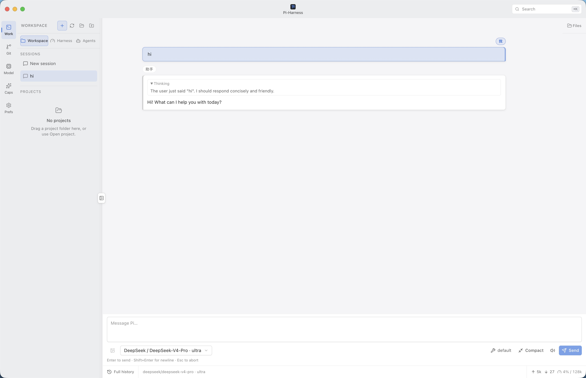    |   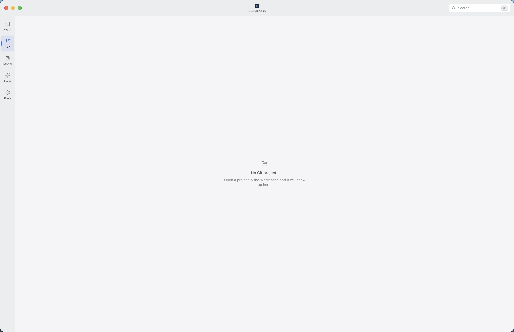   |
|                        **Центр возможностей**                         |                      **Модели**                       |
| 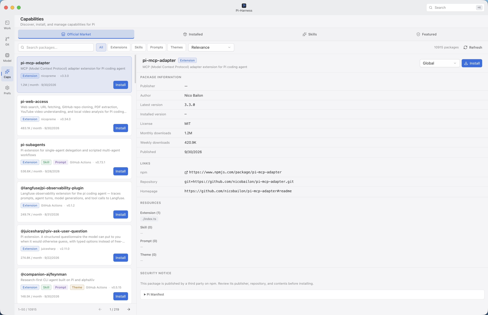 | 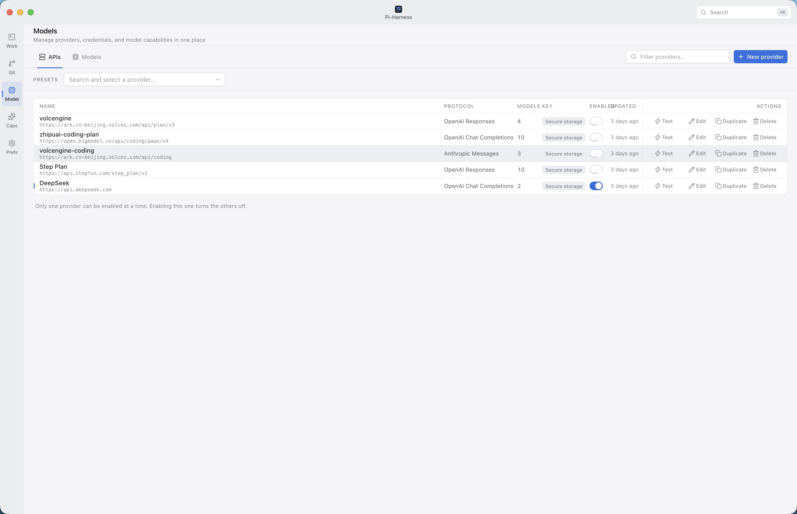 |
|                             **Настройки**                             |                                                       |
|       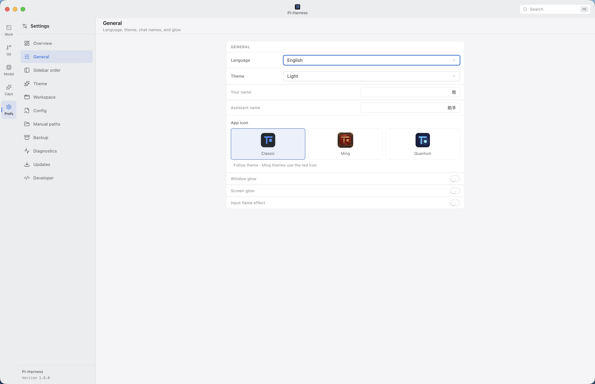        |                                                       |

### Галерея оформления v1.8.1

#### Темы рабочей области

|                                Мин · чиновник в снегу                                 |                            Мин · музыкант в снегу                             |
| :-----------------------------------------------------------------------------------: | :---------------------------------------------------------------------------: |
|                   |     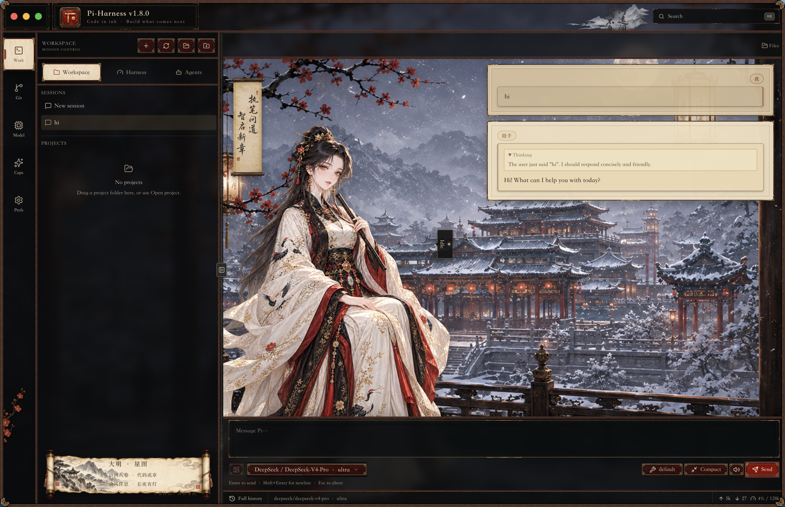      |
|                               **Мин · учёная при луне**                               |                             **Starship Cockpit**                              |
|                       |     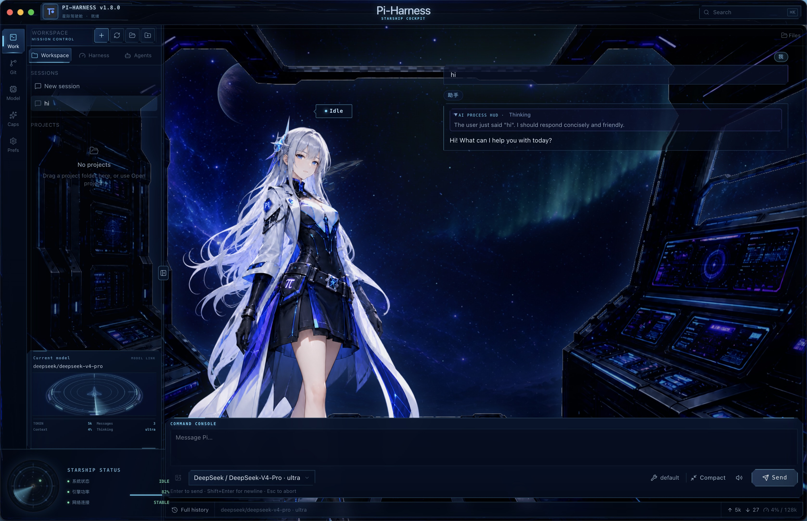      |
|                              **macOS 27 · Liquid Ether**                              |                            **Декларативная тема**                             |
|  |  |

#### Функциональные экраны

|                      Общие настройки                      |                               Галерея тем                               |
| :-------------------------------------------------------: | :---------------------------------------------------------------------: |
| 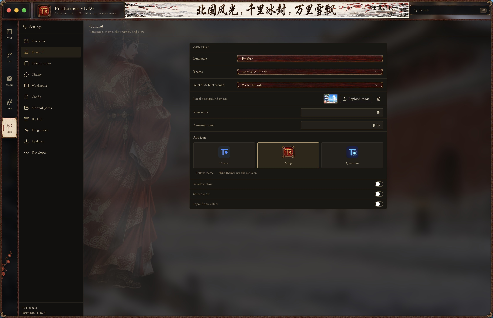 |    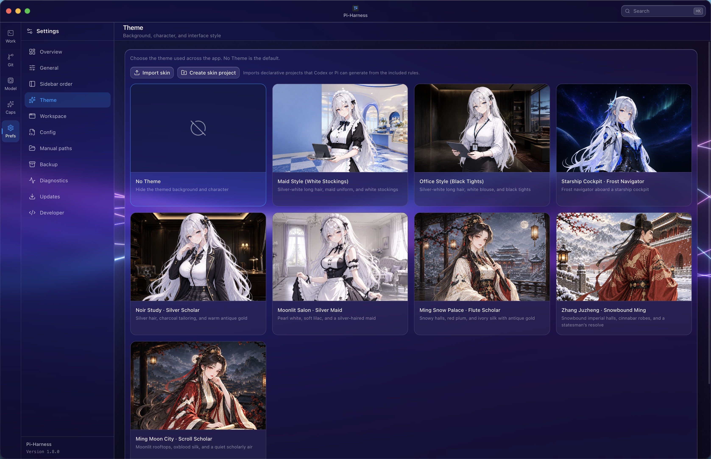    |
|                  **Центр возможностей**                   |                         **Провайдеры и модели**                         |
|    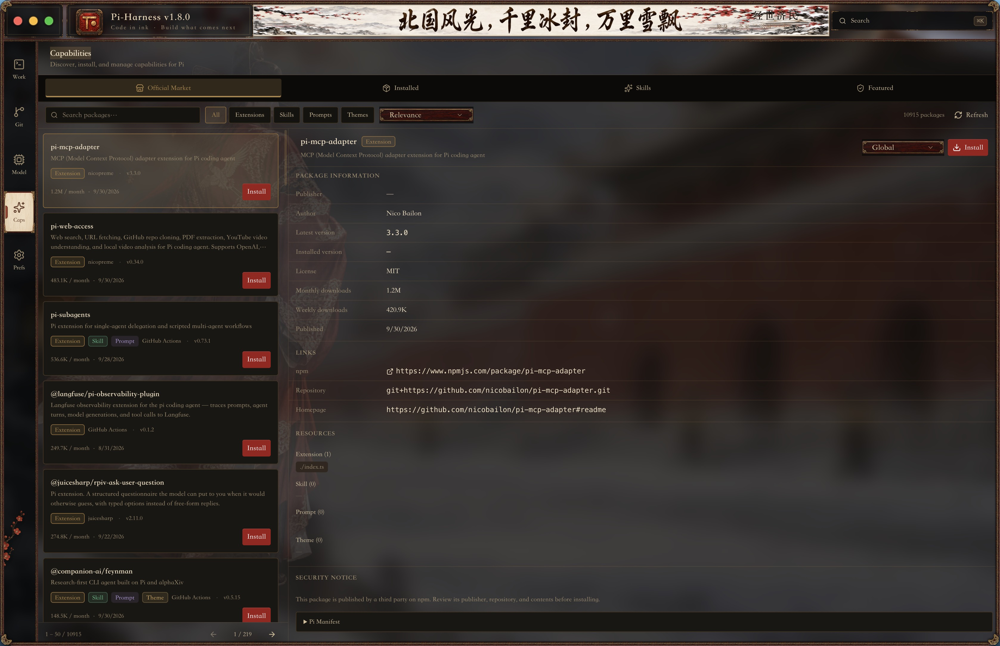     | 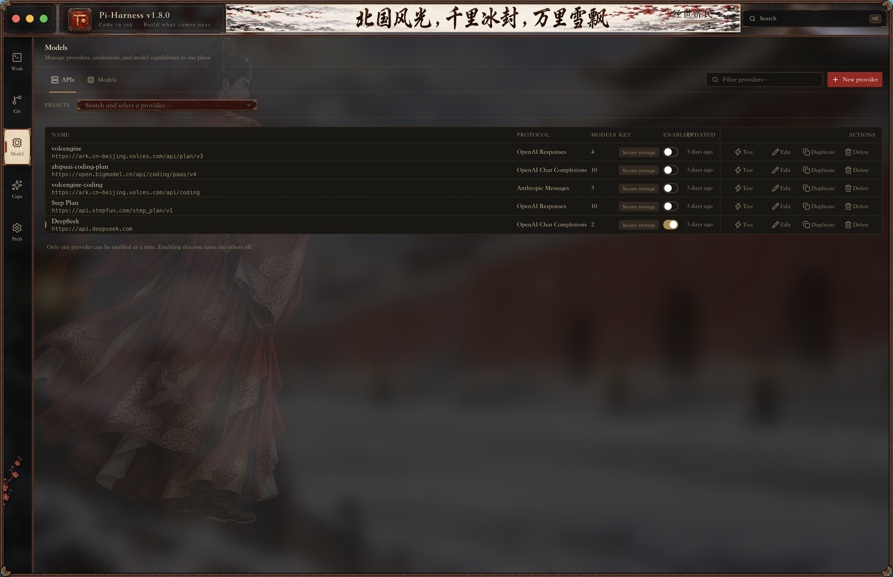 |

<p align="center">
  <strong>Git</strong><br>
  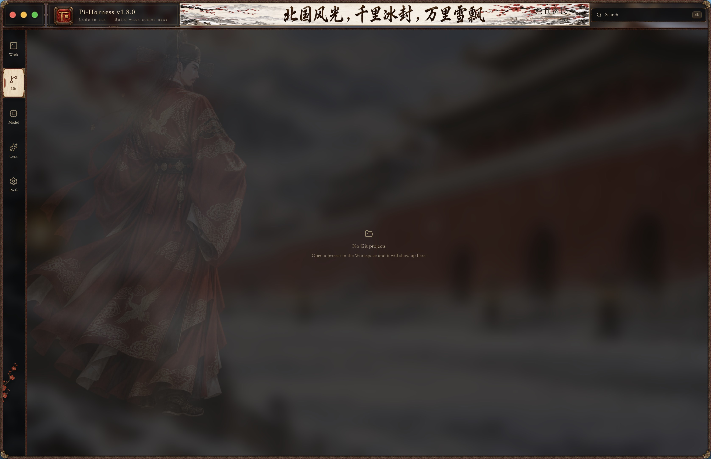
</p>

## Граница редактора

Pi-Harness редактирует читаемые текстовые файлы с подсветкой синтаксиса, номерами строк, отменой/повтором, поиском, явным сохранением и защитой от внешних изменений. Большие, бинарные, медиафайлы и документы доступны только для просмотра.

Это не IDE: нет LSP/IntelliSense, семантического рефакторинга, отладчика, запуска задач, встроенного терминала или совместимости с расширениями IDE.

## Архитектура

Native Pi находится внутри архитектуры исполнения Pi-Harness, а не заменяется ею.

```text
                         Pi-Harness
┌─────────────────────────────────────────────────────┐
│                                                     │
│                Superset Capabilities                │
│                                                     │
│  Observe              Control          Orchestrate  │
│  ─────────            ─────────        ───────────  │
│  Runs                 Policy           Agents       │
│  Trace                Budget           Teams        │
│  Replay               Checkpoints      Tasks        │
│  Diagnostics          Recovery         DAG          │
│  Evaluation           Permissions      Handoffs     │
│  Regression                            Review Gates │
│  Artifacts                             Worktrees    │
│                                                     │
│  Workspace · Models · Providers · Skills · Git      │
│                                                     │
│  ┌───────────────────────────────────────────────┐  │
│  │                  Native Pi                    │  │
│  │                                               │  │
│  │ Agent Runtime · Sessions · Context · Tools    │  │
│  │ Compaction · Thinking · Skills · Extensions  │  │
│  └───────────────────────────────────────────────┘  │
│                                                     │
└─────────────────────────────────────────────────────┘
```

Граница desktop-слоёв остаётся такой: `Vue Renderer → typed preload API → validated IPC → Main services → Pi compatibility layer → Native Pi SDK`. Session совместимы с Pi CLI JSONL в <code>~/.pi/agent/sessions/</code>.

## Harness Control Plane

Уже выпущены Runs, Trace, Replay, Run Tree, Run Compare, Policy, Budget, Checkpoints, Recovery, Permissions, Evaluation, Diagnostics, Regression и Artifacts. Данные поступают из реальных Pi Event, Session и результатов команд.

## Multi-Agent-оркестрация

Поддерживаются Agents, Teams, Tasks, Dependencies, Handoffs, Review Gates, Budget, изоляция Worktree, а также pause, resume, abort, retry, skip и reassign. Каждый Agent работает через реальный Pi Session.

## Pi Superset Contract

Pi-Harness — operational superset для Pi Coding Agent. Он сохраняет нативный Agent Runtime и совместимость Pi, добавляя наблюдаемость, управление, оркестрацию, восстановление, оценку и визуальное инженерное рабочее пространство.

- Pi-Harness намеренно не сокращает возможности Native Pi и сохраняет совместимость с нативными форматами Pi там, где это технически возможно.
- Native Pi всегда остаётся средой выполнения. Pi-Harness не переопределяет Agent Loop, Context, Compaction, Tools, Skills или Extensions.
- Нативные Session и конфигурация Pi доступны независимо; данные Harness хранятся отдельно.
- Расширения по умолчанию аддитивны, а новые функции Pi сначала проходят через слой совместимости.
- Используются capability detection, graceful degradation и best-effort forward compatibility.

## Roadmap

- Визуализация Session Tree и более глубокие Context / Queue inspectors
- Расширенные разрешения Workspace и интеграции проверки
- Harness Profiles и более интеллектуальный Run Analysis

## Требования

Готовое приложение:

- macOS Apple Silicon, macOS Intel или Windows x64
- Pi Coding Agent, который можно установить или восстановить из Pi-Harness

Разработка из исходного кода:

- Node.js ≥ 22.19.0
- pnpm 9.12.1

## Разработка

```bash
pnpm install --frozen-lockfile
pnpm dev
```

Основные проверки: pnpm typecheck, pnpm lint, pnpm test, pnpm compile, pnpm test:e2e:only. Не храните секреты в переменных VITE_* — они попадают в бандл Renderer.

## Документация

- [История изменений](CHANGELOG.md)

## Лицензия

Pi-Harness распространяется по лицензии [GNU Affero General Public License v3.0 only](LICENSE) (AGPL-3.0-only).

Copyright © 2026 [wangmiao](https://github.com/wangmiaozero).

## Автор

[wangmiao](https://github.com/wangmiaozero) · [tuziling84@gmail.com](mailto:tuziling84@gmail.com) · [github.com/wangmiaozero/pi-harness](https://github.com/wangmiaozero/pi-harness)
