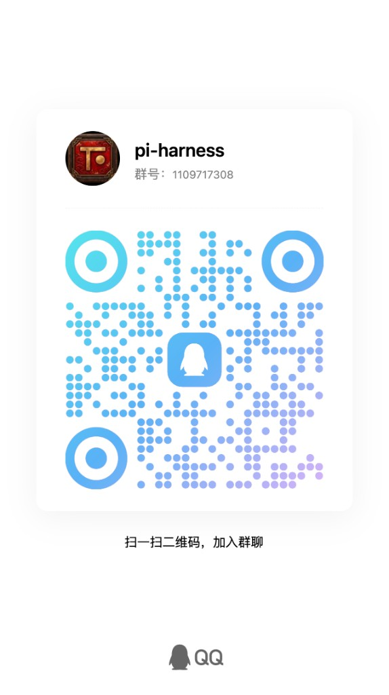

# Pi-Harness

<p align="center">
  <a href="README.md">English</a> ·
  <a href="README.zh-CN.md">简体中文</a> ·
  <a href="README.zh-TW.md">繁體中文</a> ·
  <a href="README.ja-JP.md">日本語</a> ·
  <a href="README.ko-KR.md">한국어</a> ·
  <a href="README.ru-RU.md">Русский</a> ·
  <a href="README.fr-FR.md">Français</a> ·
  <a href="README.de-DE.md">Deutsch</a>
</p>

<p align="center">
  
</p>

<h3 align="center">Pi Coding Agent 的 Operational Superset</h3>

<p align="center">
  <strong>完整保留 Native Pi，并增加观测、控制、恢复、评估与多 Agent 编排。</strong>
</p>

<p align="center">Native Pi，全面增强。</p>

<p align="center"><code>Pi Coding Agent ⊂ Pi-Harness</code></p>

<p align="center">
  <a href="#下载"><strong>下载 Pi-Harness</strong></a> ·
  <a href="https://github.com/earendil-works/pi">Pi Agent Harness</a> ·
  <a href="#当前界面">界面预览</a> ·
  <a href="#技术交流">技术交流</a>
</p>

<p align="center">
  <a href="https://github.com/wangmiaozero/pi-harness/releases/tag/v1.7.1"></a>
  
  <a href="LICENSE"></a>
  <a href="https://github.com/wangmiaozero/pi-harness/stargazers"></a>
</p>

<p align="center">
  ⭐ <a href="https://github.com/wangmiaozero/pi-harness/stargazers">点个 Star</a>，关注 Pi-Harness。
</p>

## 为什么是 Pi-Harness？

Pi-Harness 是 Pi Coding Agent 的 Operational Superset。

它继续使用 Native Pi 作为唯一 Agent Runtime，并保持对 Pi Session、Tools、Models、Skills、Extensions、Context 与 Compaction 的兼容，同时在 Pi 之上增加完整的 Harness 工程能力。

Pi-Harness 增加：

- **Observe / 观测** — Runs、Trace、Replay、Diagnostics、Evaluation、Regression、Artifacts
- **Control / 控制** — Policy、Budget、Checkpoints、Recovery、Permissions、工具控制
- **Orchestrate / 编排** — Agents、Teams、Tasks、Dependencies、Handoffs、Review Gates、Worktrees
- **Work / 工程工作区** — Workspace、Files、Git、Models、Providers、Skills、Packages

> **Pi 负责运行 Agent；Pi-Harness 让 Pi 变成可观测、可控制、可恢复、可编排的工程系统。**

Pi-Harness 不替换，也不重新实现 Pi 的 Agent Runtime。

## 什么叫 Superset？

Native Pi 始终位于真实执行链路中。

```text
Pi Coding Agent
├── Agent Runtime
├── Session
├── Context
├── Tools
├── Models
├── Thinking
├── Compaction
├── Skills
└── Extensions

              ⊂

Pi-Harness
├── 上述全部 Native Pi 能力
├── Runs / Trace / Replay
├── Policy / Budget
├── Checkpoints / Recovery
├── Evaluation / Diagnostics
├── Regression / Artifacts
├── Multi-Agent Orchestration
├── Tasks / DAG / Handoffs
├── Review Gates / Worktrees
└── Visual Engineering Workspace
```

## 核心能力

| 层级               | 能力                                                                                      |
| ------------------ | ----------------------------------------------------------------------------------------- |
| Native Pi Runtime  | Agent Runtime、Sessions、Context、Tools、Models、Thinking、Compaction、Skills、Extensions |
| Observe / 观测     | Runs、Trace、Replay、Run Compare、Diagnostics、Evaluation、Regression、Artifacts          |
| Control / 控制     | Policy、Budget、Checkpoints、Recovery、Permissions、工具控制、Compaction                  |
| Orchestrate / 编排 | Agents、Teams、Tasks、Dependencies、Handoffs、Review Gates、Worktree 隔离                 |
| Work / 工程工作区  | Workspace、Files、Git、Worktrees、Models、Providers、Skills、Packages                     |

### 启动与外观

Pi-Harness 启动时会显示动画，并检测 npm 软件源、Node.js、npm、Pi Agent 与当前配置。动画至少显示 5 秒；默认使用单色量子粒子效果，启用特色主题后会跟随所选主题呈现对应效果。

在“设置 → 通用”中，可以选择经典、大明或量子应用图标，也可以让 Pi-Harness 自动选择；窗口光圈、屏幕光圈与输入框火焰效果均可独立控制。无吉祥物版本会保留默认启动动画和这些外观设置，但不会加载可选吉祥物主题。

### 可选方法论与增强能力

Native Pi 始终是内置默认运行时与默认工作流。Pi-Harness 不会替换它，也不会静默安装或启用任何第三方方法论。

- [Superpowers](https://github.com/obra/superpowers) 是推荐的可选增强能力：一套面向编码智能体的完整软件开发方法论，覆盖头脑风暴、计划、TDD、系统化调试、Git worktree、子智能体与并行智能体工作流、代码审查和完成前验证。可在能力中心明确确认后通过 `pi install git:github.com/obra/superpowers` 安装。
- [Odai](https://github.com/orziz/odai) 保留为可选的治理与自适应执行方法论，用于目标对齐、授权边界、风险感知、能力路由、证据留存与验证。

两者都复用现有可信能力/包管理流程，可独立更新或卸载。

### 轻量编辑器，不是 IDE

Pi-Harness 可以编辑可读文本文件，支持懒加载语法高亮、行号、撤销/重做、查找、显式保存、未保存状态和外部变更冲突保护。超大文件、二进制、媒体和文档使用只读预览。

它不提供 LSP/IntelliSense、语义重构、调试器、任务运行器、集成终端或 IDE 扩展兼容。

## 当前界面

下面用默认主题与古风主题分别展示同一组主要界面。古风主题工作区包含雪景与月夜两套界面。

### 默认主题

|                    工作区                    |                   Git                    |
| :------------------------------------------: | :--------------------------------------: |
|     |    |
|                 **Provider**                 |                 **模型**                 |
|  |  |
|                 **能力中心**                 |                 **设置**                 |
|   |  |

### 古风主题

|               工作区（雪景）                |               工作区（月夜）                |
| :-----------------------------------------: | :-----------------------------------------: |
|  |  |
|                     Git                     |                **Provider**                 |
|           |     |
|                  **模型**                   |                **能力中心**                 |
|         |      |
|                  **设置**                   |                                             |
|         |                                             |

## Pi 与 Pi-Harness

| 能力          | Native Pi | Pi-Harness           |
| ------------- | --------- | -------------------- |
| Agent Runtime | 支持      | Native Pi            |
| Agent Loop    | 支持      | Native Pi            |
| Sessions      | 支持      | 支持 + 可视化管理    |
| Context       | 支持      | 支持 + 检查视图      |
| Compaction    | 支持      | 支持 + 可视化控制    |
| Steering      | 支持      | 支持                 |
| Follow-up     | 支持      | 支持                 |
| Models        | 支持      | 支持 + 管理器        |
| Thinking      | 支持      | 支持 + 可视化控制    |
| Tools         | 支持      | 支持 + 选择与 Policy |
| Skills        | 支持      | 支持 + 管理器        |
| Extensions    | 支持      | 支持 + 管理器        |
| Runs          | —         | 支持                 |
| Trace         | —         | 支持                 |
| Replay        | —         | 支持                 |
| Evaluation    | —         | 支持                 |
| Policy        | —         | 支持                 |
| Budget        | —         | 支持                 |
| Checkpoint    | —         | 支持                 |
| Recovery      | —         | 支持                 |
| Diagnostics   | —         | 支持                 |
| Regression    | —         | 支持                 |
| Artifacts     | —         | 支持                 |
| Multi-Agent   | —         | 支持                 |
| Task DAG      | —         | 支持                 |
| Handoff       | —         | 支持                 |
| Review Gates  | —         | 支持                 |
| Worktree 隔离 | —         | 支持                 |

## 架构

Native Pi 位于 Pi-Harness 的执行架构内部，而不是被 Pi-Harness 替换。

```text
                         Pi-Harness
┌─────────────────────────────────────────────────────┐
│                                                     │
│                Superset Capabilities                │
│                                                     │
│  Observe              Control          Orchestrate  │
│  ─────────            ─────────        ───────────  │
│  Runs                 Policy           Agents       │
│  Trace                Budget           Teams        │
│  Replay               Checkpoints      Tasks        │
│  Diagnostics          Recovery         DAG          │
│  Evaluation           Permissions      Handoffs     │
│  Regression                            Review Gates │
│  Artifacts                             Worktrees    │
│                                                     │
│  Workspace · Models · Providers · Skills · Git      │
│                                                     │
│  ┌───────────────────────────────────────────────┐  │
│  │                  Native Pi                    │  │
│  │                                               │  │
│  │ Agent Runtime · Sessions · Context · Tools    │  │
│  │ Compaction · Thinking · Skills · Extensions  │  │
│  └───────────────────────────────────────────────┘  │
│                                                     │
└─────────────────────────────────────────────────────┘
```

桌面边界保持为 `Vue Renderer → typed preload API → validated IPC → Main services → Pi compatibility layer → Native Pi SDK`。Session 与 <code>~/.pi/agent/sessions/</code> 下的 Pi CLI JSONL 保持兼容。

## Harness Control Plane

Pi-Harness 已经提供完整的 Harness Control Plane，包括：

- Runs、Trace、Replay、Run Tree、Run Compare
- Policy、Budget、Checkpoints、Recovery、Permissions
- Evaluation、Diagnostics、Regression、Artifacts
- 可筛选 Timeline 与基于真实证据的运行详情

这些能力来自真实 Pi Event、Session 和命令结果，不是模拟状态或未来功能预览。

## Multi-Agent 编排

Pi-Harness 已支持 Agents、Teams、Tasks、Dependencies、Handoffs、Review Gates、Budget 与 Worktree 隔离，并支持 pause、resume、abort、retry、skip 和 reassign。

每个 Agent 都通过真实 Pi Session 执行；编排层增加协调能力，不引入第二套 Agent Runtime。

## Pi Superset Contract

- **Pi Compatibility：**Pi-Harness 不得主动降低 Native Pi 能力；在技术可行时保持 Session、配置、模型、Provider、工具、Skills、Extensions、Packages、Context、Compaction、Steering、Follow-up、Session Tree 与 Thinking Level 兼容。
- **Pi Is the Runtime：**Native Pi 始终是 Agent 执行 Runtime。Pi-Harness 不重新实现 Agent Loop、`AgentSession`、Context、Compaction、Tool、Skill 或 Extension Runtime。
- **Native Pi Escape Hatch：**Pi 原生 Session 与配置仍可脱离 Pi-Harness 直接使用。
- **Additive by Default：**Harness 能力只在 Pi 之上增强，不替换、不削弱 Pi。
- **Shared State：**尽量使用 Pi 原生状态与格式；Pi-Harness 自有元数据独立存储。
- **Upstream First：**Pi 新能力优先经兼容层接入，并通过 capability detection、graceful degradation 与 best-effort forward compatibility 降低版本耦合。

## Roadmap

### 当前

- 上文列出的已发布桌面能力
- Pi Agent Runtime 集成与 Session 控制
- 原生项目工作区、Harness Control Plane 与 Multi-Agent 编排

### 下一步

- Session Tree 可视化
- 更深入的 Context 与 Queue Inspector
- 超越确定性规则的可选 Run 分析，并与记录证据明确区分

### 后续

- 超越当前文件 Policy 的高级 Workspace Permissions
- Verification 与质量检查集成
- Harness Profiles

## 下载

从 [GitHub Releases](https://github.com/wangmiaozero/pi-harness/releases/tag/v1.7.1) 下载 Pi-Harness v1.7.1。

| 平台                | 安装包                                                                                                                         |
| ------------------- | ------------------------------------------------------------------------------------------------------------------------------ |
| macOS Apple Silicon | [`Pi-Harness-1.7.1-arm64.dmg`](https://github.com/wangmiaozero/pi-harness/releases/download/v1.7.1/Pi-Harness-1.7.1-arm64.dmg) |
| macOS Intel         | [`Pi-Harness-1.7.1.dmg`](https://github.com/wangmiaozero/pi-harness/releases/download/v1.7.1/Pi-Harness-1.7.1.dmg)             |
| Windows x64         | [`Pi-Harness-Setup-1.7.1.exe`](https://github.com/wangmiaozero/pi-harness/releases/download/v1.7.1/Pi-Harness-Setup-1.7.1.exe) |
| Linux x64           | [`Pi-Harness-1.7.1.AppImage`](https://github.com/wangmiaozero/pi-harness/releases/download/v1.7.1/Pi-Harness-1.7.1.AppImage)   |

> **Windows 升级提示：**从 v1.7.0 升级到 v1.7.1 不会再次执行一次性旧版应用数据重置。尚未启动过 v1.7.0 正式安装包的机器，仍会一次性重置旧版 Pi-Harness 应用设置、本地密钥库、应用内备份和缓存。Pi Agent 独立数据目录与项目文件不会被重置。
>
> macOS 社区构建可能没有签名。首次启动若被系统拦截，请前往“系统设置 → 隐私与安全性 → 仍要打开”。详细说明见 [v1.7.1 Release Notes](https://github.com/wangmiaozero/pi-harness/releases/tag/v1.7.1)。

安装包用户不需要 clone 仓库，也不需要安装 pnpm。Pi-Harness 可以在支持的环境中检测、安装和修复 Node.js、npm、PATH 与 Pi Coding Agent。

## 工作流程

1. 启动 Pi-Harness，在概览页检查 Node.js、npm、PATH 与 Pi。
2. 配置 Pi 兼容 Provider，并选择模型。
3. 打开项目，进入原生工作区。
4. 新建或继续 Pi Session。
5. 在同一个界面中使用流式输出、Tool Call、文件和 Git。

```text
安装 → 配置 Provider → 选择模型 → 打开项目 → 运行 Pi
```

## 环境要求

安装包用户：

- macOS Apple Silicon、macOS Intel、Windows x64 或 Linux x64
- Pi Coding Agent，可直接在 Pi-Harness 中安装或修复

源码开发：

- Node.js ≥ 22.19.0
- pnpm 9.12.1

## 开发

```bash
pnpm install --frozen-lockfile
pnpm dev
```

本机没有 Pi 时，可在“设置 → 配置目录”中指向 <code>fixtures/mock-pi/</code>；也可以把 <code>.env.example</code> 复制为 <code>.env</code>，并将 <code>PI_HARNESS_PI_CONFIG_DIR</code> 指向该 fixture。不要在 <code>VITE_*</code> 变量中存放密钥，它们会被打进 Renderer。

常用检查：

```bash
pnpm typecheck
pnpm lint
pnpm test
pnpm compile
pnpm test:e2e:only
```

## 关注项目

Pi-Harness 接下来会继续深化 Session Tree 可视化、Context 与 Queue 检查、Workspace Permissions、Verification 集成和 Harness Profiles。

如果你对这些功能感兴趣，可以给 [Pi-Harness 点一个 ⭐](https://github.com/wangmiaozero/pi-harness/stargazers)，关注后续版本。Star 也能帮助更多 Pi 用户发现这个项目。

## 技术交流

扫码加入 QQ 群 **pi-harness**，交流使用与开发问题。

**QQ群：1109717308**

<p align="center">
  
</p>

## 致谢

Pi-Harness 是围绕官方 [Pi Coding Agent 与 Pi Agent Harness](https://github.com/earendil-works/pi) 构建的桌面项目。

项目由 [wangmiao](https://github.com/wangmiaozero) 创建并维护 · [tuziling84@gmail.com](mailto:tuziling84@gmail.com)。

已发布变更见[更新记录](CHANGELOG.md)。

## 许可协议

Pi-Harness 采用 [GNU Affero General Public License v3.0 only](LICENSE)（<code>AGPL-3.0-only</code>）发布。你可以在协议条款下使用、修改和再分发；通过网络向用户提供修改版时，必须按 AGPL v3 要求向这些用户提供对应源代码。

Copyright © 2026 [wangmiao](https://github.com/wangmiaozero)。
