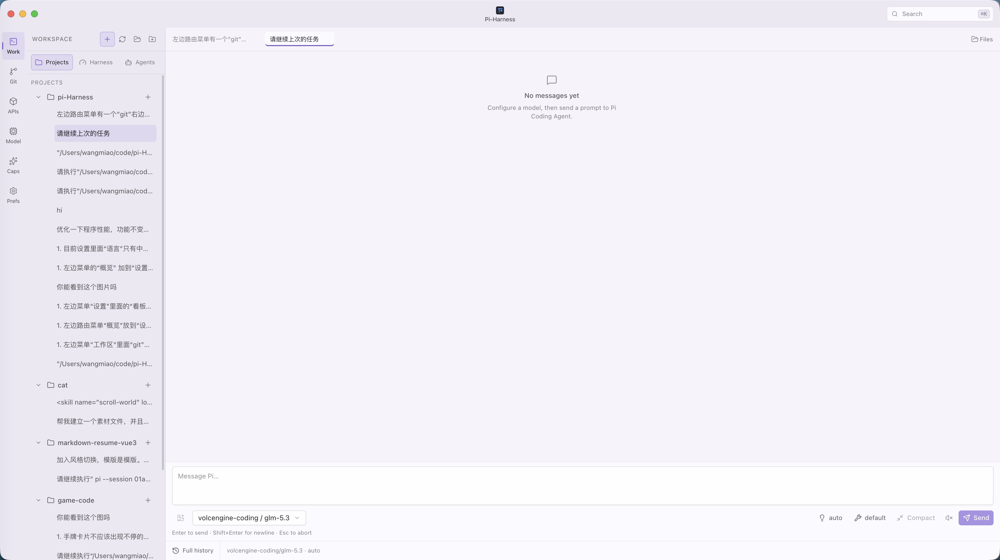
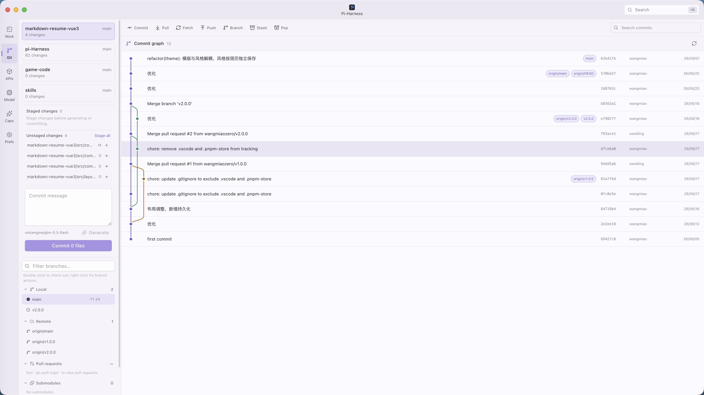
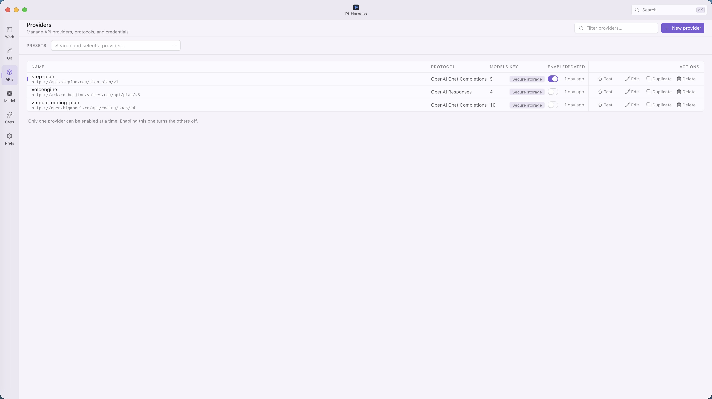
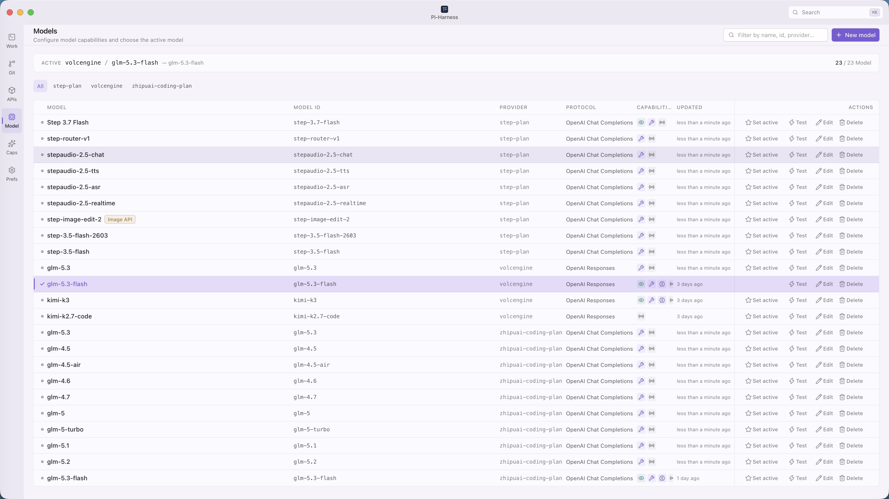
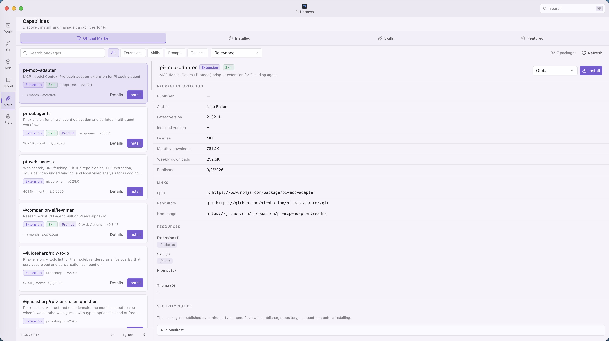
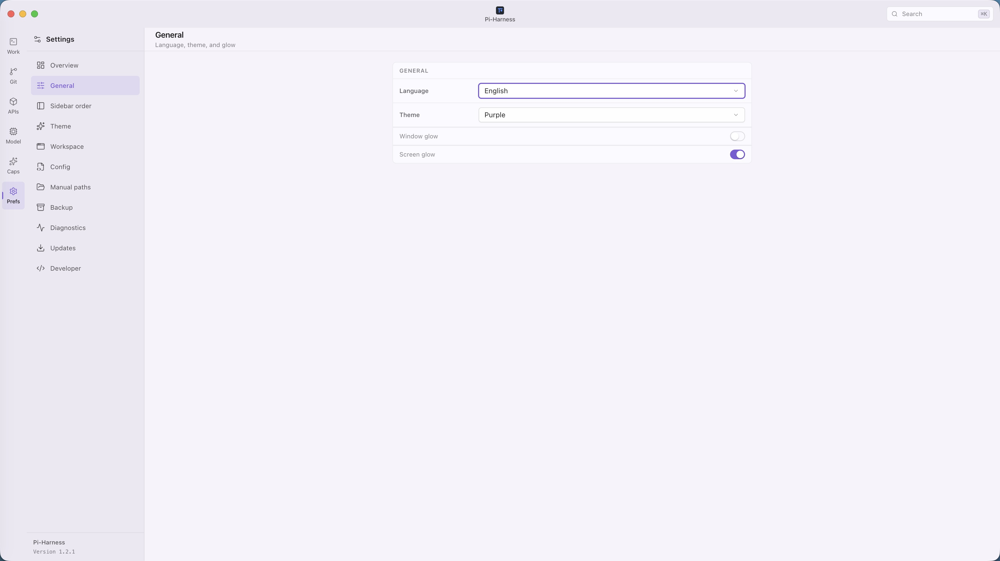
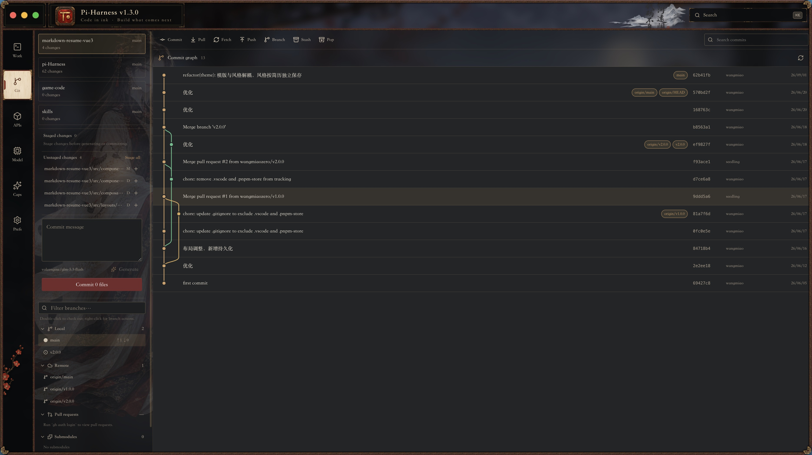
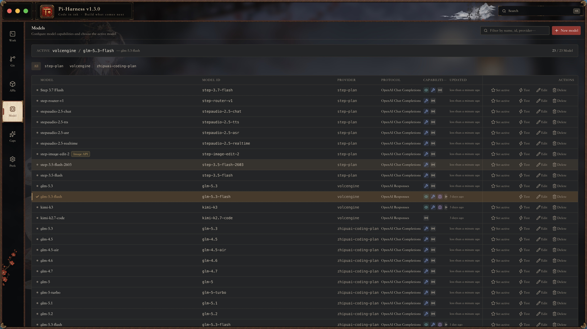
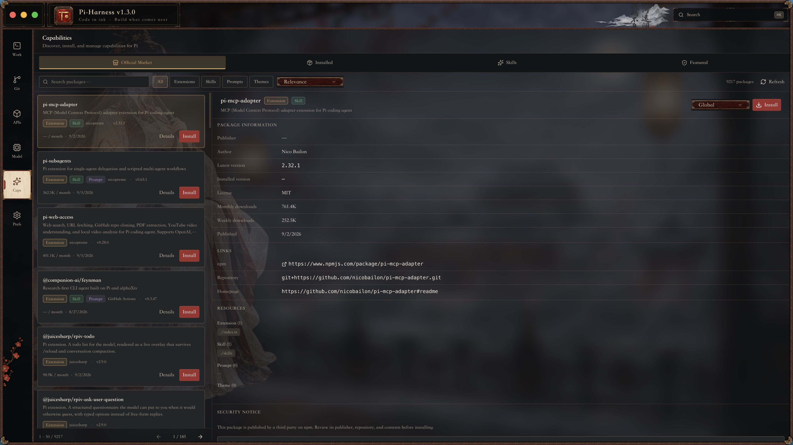
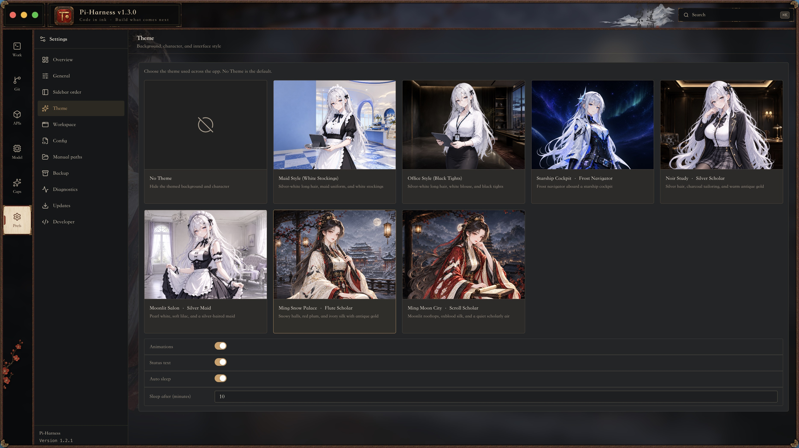

# Pi-Harness

<p align="center">
  <a href="README.md">English</a> ·
  <a href="README.zh-CN.md">简体中文</a> ·
  <a href="README.zh-TW.md">繁體中文</a> ·
  <a href="README.ja-JP.md">日本語</a> ·
  <a href="README.ko-KR.md">한국어</a> ·
  <a href="README.ru-RU.md">Русский</a> ·
  <a href="README.fr-FR.md">Français</a> ·
  <a href="README.de-DE.md">Deutsch</a>
</p>

<p align="center">
  
</p>

<p align="center">
  <strong>Pi Coding Agent 的 Superset Harness</strong><br />
  Native Pi，全面增強。
</p>

<p align="center"><code>Pi Coding Agent ⊂ Pi-Harness</code></p>

<p align="center">
  <a href="https://github.com/wangmiaozero/pi-harness/releases/tag/v1.7.0"></a>
  
  <a href="LICENSE"></a>
</p>

<p align="center">
  <a href="#下載">下載</a> ·
  <a href="#工作流程">工作流程</a> ·
  <a href="#介面預覽">介面預覽</a> ·
  <a href="#開發">開發</a>
</p>

## 為什麼選擇 Pi-Harness？

### 不只是 Pi 聊天介面

一般桌面用戶端解決的是「開啟 Pi 並開始聊天」。Pi-Harness 進一步將環境設定、Provider、模型、Skills、擴充套件、專案、檔案和 Git 集中到一個桌面工作區中。

```text
一般桌面用戶端                         Pi-Harness

Pi → Chat                             Environment
                                      + Providers / Models
                                      + Skills / Packages / MCP adapters
                                      + Workspace / Sessions / Files / Git
                                      ↓
                                      Pi Coding Agent
```

Pi-Harness 不是網頁封裝：不嵌入 pi-web、Next.js 服務或 iframe，也不實作第二套 Agent Runtime。Pi Coding Agent 始終是唯一的 Agent Runtime，工作階段與 `~/.pi/agent/sessions/` 下的 Pi CLI JSONL 保持相容。

**設定 Pi。執行 Pi。擴充 Pi。**

## Pi Superset Contract

Pi-Harness 是 Pi Coding Agent 的 operational superset：保留 Native Pi 的 Agent Runtime 與相容性，再加入可觀測性、治理、編排、復原、評估與視覺化工程工作區。

- 不主動降低 Native Pi 能力，並在技術可行時維持 Pi 原生格式相容。
- Native Pi 始終是執行 Runtime；不重新實作 Agent Loop、Context、Compaction、Tools、Skills 或 Extensions。
- Pi 原生 Session 與設定仍可獨立使用；Harness 專屬狀態分開儲存。
- 新增能力預設只做加法；Pi 新功能優先透過相容層接入。
- 使用 capability detection、graceful degradation 與 best-effort forward compatibility。

## Pi 與 Pi-Harness 能力矩陣

| 能力                                 | Native Pi | Pi-Harness               |
| ------------------------------------ | --------- | ------------------------ |
| Agent Runtime / Loop                 | 支援      | Native Pi                |
| Sessions / Context / Compaction      | 支援      | 支援 + 視覺化管理與控制  |
| Steering / Follow-up / Thinking      | 支援      | 支援 + 視覺化控制        |
| Models / Tools / Skills / Extensions | 支援      | 支援 + Manager 與 Policy |
| Runs / Trace / Replay / Compare      | —         | 支援                     |
| Policy / Budget / Evaluation         | —         | 支援                     |
| Checkpoint / Recovery / Diagnostics  | —         | 支援                     |
| Regression / Artifacts               | —         | 支援                     |
| Multi-Agent / Task DAG / Handoff     | —         | 支援                     |
| Review Gates / Worktree 隔離         | —         | 支援                     |

## 下載

從 [GitHub Releases](https://github.com/wangmiaozero/pi-harness/releases/tag/v1.7.0) 下載 Pi-Harness v1.7.0。

| 平台                | 安裝程式                                                                                                                       |
| ------------------- | ------------------------------------------------------------------------------------------------------------------------------ |
| macOS Apple Silicon | [`Pi-Harness-1.7.0-arm64.dmg`](https://github.com/wangmiaozero/pi-harness/releases/download/v1.7.0/Pi-Harness-1.7.0-arm64.dmg) |
| macOS Intel         | [`Pi-Harness-1.7.0.dmg`](https://github.com/wangmiaozero/pi-harness/releases/download/v1.7.0/Pi-Harness-1.7.0.dmg)             |
| Windows x64         | [`Pi-Harness-Setup-1.7.0.exe`](https://github.com/wangmiaozero/pi-harness/releases/download/v1.7.0/Pi-Harness-Setup-1.7.0.exe) |
| Linux x64           | [`Pi-Harness-1.7.0.AppImage`](https://github.com/wangmiaozero/pi-harness/releases/download/v1.7.0/Pi-Harness-1.7.0.AppImage)   |

> **Windows 升級提示：**首次啟動 v1.7.0 正式安裝程式會一次性重設舊版 Pi-Harness 應用程式資料，包括應用程式設定、本機憑證庫、應用程式內備份與快取。之後需重新設定偏好與憑證。Pi Agent 的獨立資料目錄與專案檔案不會被重設。
>
> macOS 社群組建可能未簽署。若系統阻擋首次啟動，請前往「系統設定 → 隱私權與安全性 → 仍要打開」。詳細說明請參閱 [v1.7.0 Release Notes](https://github.com/wangmiaozero/pi-harness/releases/tag/v1.7.0)。

安裝程式使用者不需要 clone 儲存庫，也不需要安裝 pnpm。Pi-Harness 可在支援的環境中偵測、安裝及修復 Node.js、npm、PATH 與 Pi Coding Agent。

## 您可以做什麼

### 工作區

開啟實際專案，建立或繼續 Pi 工作階段，讓 Thinking、Tool Call、串流回覆和修改中的檔案位於同一個工作區。

### Provider 與模型

使用 Pi 相容預設或自訂 API；在服務支援時取得模型目錄、測試連線，並選擇目前模型。

### Skills、擴充套件與 MCP

建立及管理本機 Skills 與 Pi Package，並透過支援的擴充套件連接 MCP。

### 執行環境

偵測 Node.js、npm、PATH 與 Pi Coding Agent，直接在桌面應用程式中安裝或修復常見環境問題。

### 檔案與 Git

瀏覽及上傳檔案、安全編輯可讀文字、查看 Git Diff，並使用專案 Worktree；定位仍是輕量工作區，而不是 IDE。

### 診斷與安全性

查看環境、儲存、工作區與功能健康狀態。

## 工作流程

1. **啟動 Pi-Harness**，在概覽頁檢查 Node.js、npm、PATH 與 Pi。
2. **設定 Provider**，選擇預設或填寫自己的 Pi 相容 API。
3. **選擇模型**，並執行連線測試。
4. **開啟專案**，進入原生工作區。
5. **建立或繼續 Pi 工作階段**，使用串流輸出、Tool Call、檔案和 Git 上下文完成工作。

```text
安裝 → 設定 Provider → 選擇模型 → 開啟專案 → 執行 Pi
```

## 介面預覽

以下以預設主題與古風主題，分別展示相同的主要介面。古風主題工作區包含雪景與月夜兩套畫面。

### 預設主題

|                    工作區                    |                   Git                    |
| :------------------------------------------: | :--------------------------------------: |
|     |    |
|                 **Provider**                 |                 **模型**                 |
|  |  |
|                 **能力中心**                 |                 **設定**                 |
|   |  |

### 古風主題

|               工作區（雪景）                |               工作區（月夜）                |
| :-----------------------------------------: | :-----------------------------------------: |
|  |  |
|                     Git                     |                **Provider**                 |
|           |     |
|                  **模型**                   |                **能力中心**                 |
|         |      |
|                  **設定**                   |                                             |
|         |                                             |

## 核心功能

| 模組              | Pi-Harness 提供的功能                     |
| ----------------- | ----------------------------------------- |
| 概覽              | 顯示環境、設定和目前模型狀態              |
| 工作區            | 在專案檔案與 Git 上下文中執行 Pi 工作階段 |
| Provider 與模型   | 管理 Pi 相容 Provider 和模型              |
| Skills 與 Package | 管理支援的 Skills 和擴充套件              |
| 設定              | 編輯 Pi 設定並提供衝突保護                |
| 診斷              | 查看應用程式與環境健康狀態                |
| 更新              | 安裝相容的應用程式更新                    |
| 外觀              | 提供應用程式圖示、主題、密度與視覺效果    |

### 啟動與外觀

Pi-Harness 啟動時會顯示動畫，並檢查 npm 軟體源、Node.js、npm、Pi Agent 與目前設定。動畫至少顯示 5 秒；預設使用單色量子粒子效果，啟用特色主題後會跟隨所選主題呈現對應效果。

在「設定 → 一般」中，可以選擇經典、大明或量子應用程式圖示，也可以讓 Pi-Harness 自動選擇；視窗光圈、螢幕光圈與輸入框火焰效果均可獨立控制。無吉祥物版本會保留預設啟動動畫與這些外觀設定，但不會載入可選吉祥物主題。

### 輕量編輯器，而不是 IDE

Pi-Harness 可編輯可讀文字檔案，支援延遲載入語法醒目提示、行號、復原/重做、尋找、明確儲存、未儲存狀態和外部變更衝突保護。超大型檔案、二進位、媒體和文件使用唯讀預覽。

它不提供 LSP/IntelliSense、語意重構、偵錯工具、工作執行器、整合式終端機或 IDE 擴充功能相容性。

## 架構

Pi-Harness 將「管理 Pi、使用 Pi、擴充 Pi」分層，同時始終保持 Pi Coding Agent 是唯一的 Agent Runtime。

```text
                                Pi-Harness

              ┌────────────────────┼────────────────────┐
              │                    │                    │
              ▼                    ▼                    ▼
       Control Plane          Workspace          Capability Layer
       管理 Pi                使用 Pi             擴充 Pi

       Providers              Projects           Skills
       Models                 Sessions           Packages
       Environment            Agent              MCP adapters
       Config / Secrets       Streaming          Presets
       Backup / Diagnostics   Files / Git
       Updates                Worktree
              │                    │                    │
              └────────────────────┼────────────────────┘
                                   ▼
                           Pi Coding Agent
```

桌面邊界固定為 `Vue Renderer → typed preload API → validated IPC → Main services → Pi SDK / 作業系統`。Domain Adapter 會保留 Pi 設定中的未知欄位。

## 環境需求

安裝程式使用者：

- macOS Apple Silicon、macOS Intel 或 Windows x64
- Pi Coding Agent，可直接在 Pi-Harness 中安裝或修復

從原始碼開發：

- Node.js ≥ 22.19.0
- pnpm `9.12.1`

## 開發

```bash
pnpm install --frozen-lockfile
pnpm dev
```

本機未安裝 Pi 時，可在「設定 → 設定目錄」中指向 `fixtures/mock-pi/`；也可以將 `.env.example` 複製為 `.env`，並將 `PI_HARNESS_PI_CONFIG_DIR` 指向該 fixture。請勿在 `VITE_*` 變數中存放金鑰，它們會被打包進 Renderer bundle。

常用檢查：

```bash
pnpm typecheck
pnpm lint
pnpm test
pnpm compile
pnpm test:e2e:only
```

## 文件

- [更新記錄](CHANGELOG.md)

## 授權條款

Pi-Harness 採用 [GNU Affero General Public License v3.0 only](LICENSE)（`AGPL-3.0-only`）發佈。您可以依照授權條款使用、修改和再散佈；透過網路向使用者提供修改版本時，必須依照 AGPL v3 要求向這些使用者提供對應原始碼。

Copyright © 2026 [wangmiao](https://github.com/wangmiaozero)。

## 作者

[wangmiao](https://github.com/wangmiaozero) · [tuziling84@gmail.com](mailto:tuziling84@gmail.com) · [github.com/wangmiaozero/pi-harness](https://github.com/wangmiaozero/pi-harness)
